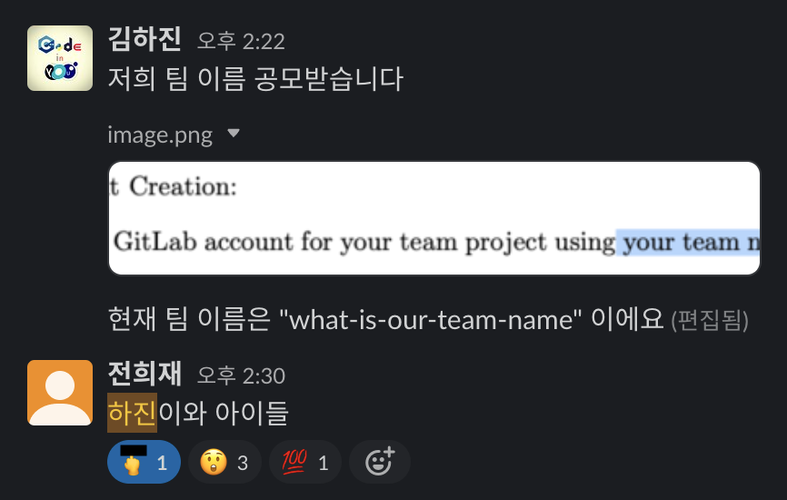
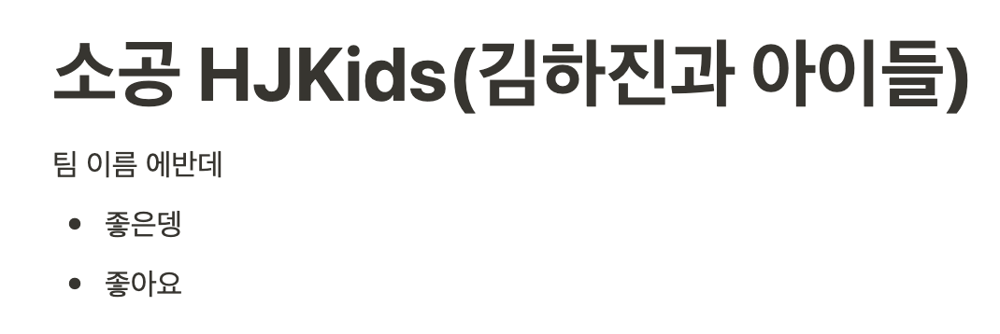
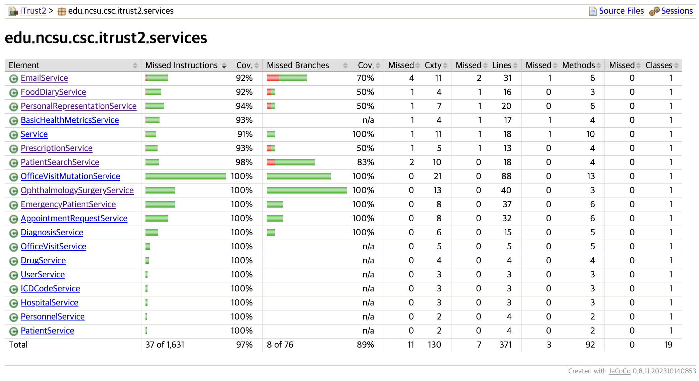

# HJKids(김하진과 아이들) 팀

## 소개

### 팀 소개

팀 이름은 당시 회의 참석한 8명 중 7명의 찬성과 1명의 반대로 결정되었습니다.

### 조직, 구성원, 리더십 로테이션

[이 문서](./members.md)에 명단, 연락처, 리더십 로테이션, 조직 구성, 소개 등을 정리하였습니다.

## 프로젝트 문제 상황

### 극복할 제약사항

- 고객의 요구사항은 변동되지 않고, 피드백을 받기 어렵습니다.
- 각 이터레이션마다 특정한 요구사항(새 UC 제안 등) 및 일정 이상의 진행이 필요합니다.
- 현황을 공유하고 평가받을 기회는 각 이터레이션 종료 시점, 약 3주 간격으로 3번입니다.
- 팀원 각각의 참여 시점이 비동기적입니다. 페어 프로그래밍이나 실시간 의사소통이 어렵습니다. 단, 각 조직별 정기 모임에는 참여가 가능함을 전제로 합니다.
- 서로 약간 어색합니다.
- 대체로, 각자의 개발 경험이 적습니다.
- 레거시 코드를 도움없이 직접 분석해야 하며, 문서화 수준이 높지 않습니다.
- 프로젝트 종료 후 유지보수되지 않을 가능성이 높습니다.

### 추가 목표

- 개인의 성장 극대화에 초점을 두고, 강점과 희망사항을 존중합니다.
- 각자에게 적절한 태스크를 고르게 부여합니다.
- 유지보수 가능한 코드 및 운영 가능한 시스템 개발을 목표로 합니다.
- 리더십 트레이닝: 팀장은 feature 코드를 직접 작성하지 않습니다.

## 새 유즈케이스

[UC23 Send Actual Emails](./new-uc23.md)

## 미팅 로그

[미팅 로그](./meeting-logs/README.md)

## 개발 프로세스 및 문화

[개발 프로세스 및 문화](./process-and-culture.md)

## 협업 도구

[협업 도구](./collaboration-tools.md)

## Overall schedule

## Test coverage

비즈니스 로직에 대한 unit test의 instruction coverage는 97%입니다.

## Demonstrations

- [Iteration 1 Demonstration](./presentation/1031-iteration-1/README.md)
- [Iteration 2 Demonstration](./presentation/1123-iteration-2/README.md)
- [Iteration 3 Demonstration](./presentation/1212-iteration-3/README.md)
