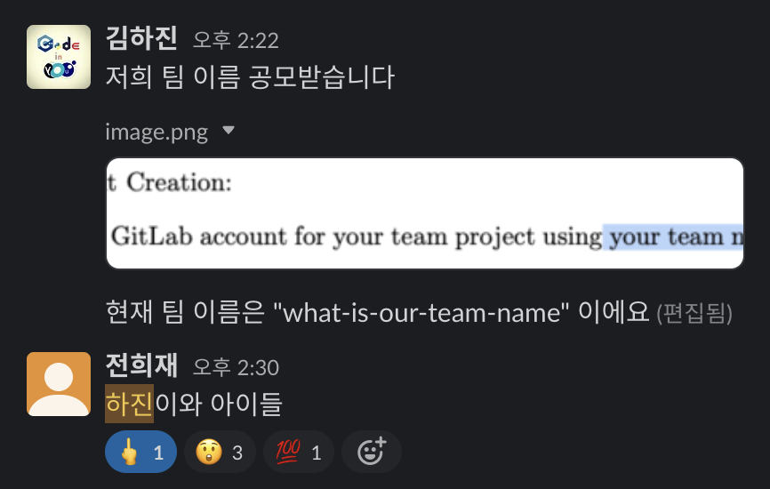

# HJKids(김하진과 아이들) 팀

## 소개

### 팀 소개

팀 이름은 당시 회의 참석한 8명 중 7명의 찬성과 1명의 반대로 결정되었습니다.

### 팀원 명단

Contact information 기재는 10월 말까지 하기로 했습니다.

| 성함   | 학번       | GitLab username | Contact #1                       | Contact #2                                                                      |
| ------ | ---------- | --------------- |----------------------------------|---------------------------------------------------------------------------------|
| 김지안 | 2021147532 | 2021147532      |                                  |                                                                                 |
| 김하진 | 2019147580 | 2019147580      | [Email](kimhajin@yonsei.ac.kr)   | [LinkedIn](https://www.linkedin.com/in/kim-hajin)                               |
| 박민지 | 2019147538 | 2019147538      | [Email](0225minji@yonsei.ac.kr)  | [LinkedIn](https://www.linkedin.com/in/minji-park-187696291/)                   |
| 박정양 | 2020147580 | JungyangPark    | [Email](wjddid000624@gmail.com)  | [LinkedIn](www.linkedin.com/in/jungyang-park-661109290)                         |
| 성현준 | 2019147593 | sunghj1118      | [Email](sunghj1118@yonsei.ac.kr) | [LinkedIn](https://www.linkedin.com/in/hyunjoon-sung/)                          |
| 윤장한 | 2019147574 | 2019147574      |                                  |                                                                                 |
| 윤정현 | 2019147516 | 2019147516      | [Email](grant9390@naver.com)     | [LinkedIn](https://www.linkedin.com/in/dev-qb)                                  |
| 이상헌 | 2019147549 | SangHeonLee     |                                  |                                                                                 |
| 전희재 | 2020147512 | 2020147512      | [Email](0914eagle@yonsei.ac.kr)  | [LinkedIn](https://www.linkedin.com/in/%ED%9D%AC%EC%9E%AC-%EC%A0%84-3391b7273/) |
| 홍세아 | 2020147020 | 2020147020      | [Email](hongkayla@yonsei.ac.kr)  |                                                                                 |

### 팀원 소개

소개 및 경력 등 기재는 10월 말까지 하기로 했습니다.

#### 김하진

팀장입니다.
여러분들의 최대한의 성장과 역량 발휘를 위해 노력하겠습니다.

산업기능요원으로 복무하며 Kotlin + Spring Boot로 백엔드를 개발하였고, 백엔드 파트장 및 프로젝트 매니저를 맡았습니다.

팀 및 프로젝트 운영, 세미나 개설, 코드 리팩토링 등을 맡습니다.

#### 김지안

#### 박민지

동아리와 현장실습 등에서 Express, Flask와 같은 백엔드 프레임워크와 React, Flutter와 같은 프론트엔드 프레임워크를 사용한 웹/앱 개발을 경험해보았습니다.

프론트엔드 팀에서 활동하고 있습니다. Angular는 처음이라 열심히 공부할 예정입니다.

#### 박정양

백엔드 팀에서 활동하고 있습니다. 백엔드 개발 경험이 거의 없습니다. 다만 스프링부트를 현재 공부 중에 있어 응용 해보고 싶어 지원했습니다.

#### 성현준

인프라 팀에서 활동하고 있습니다.
반복적인 작업을 최대한 줄이기 위해서 CI/CD 파이프라인을 구축하고 있습니다.
최근에는 쿠버네티스에 관심이 생겨서 개별적으로 공부하고 있습니다.

#### 윤장한

#### 윤정현

백엔드 팀에서 활동하고 있습니다.  
육군 GOP 감시장비병으로 근무하며 감시장비 운용 보조 프로그램 개발을 통해 표창을 받은 이력이 있으며,
모바일 앱 개발 QA팀에서 근무하며 개발 프로세스 과정 이해 및 이슈 트래킹 경험을 쌓았습니다.  
현재의 목표는 게임 개발자이며, 이 외에도 최대한 다양한 분야의 개발 프로세스에 참여하는 것을 목표로 하고 있습니다.

#### 이상헌

#### 전희재

백엔드 팀에서 활동하고 있습니다. 백엔드 개발 경험이 거의 없어 이번 기회로 접해볼 마음으로 지원하였고
열심히 공부하는 중입니다.

AI 공부를 하고 있어 웹 개발에 많은 역할을 맡지 못하지만 노력하겠습니다. 현재 이동하 교수님 랩실 인턴으로 활동하고 있습니다.(팀장님 강조....)

#### 홍세아
백엔드 팀과 Cell A에 속해있습니다.
데이터베이스를 다루는 것에 관심을 가지고 있습니다.

## 조직 구성

### 셀

셀은 개발의 단위이며, 이터레이션마다 2개씩 운영합니다.
유즈케이스는 하나의 셀에서만 맡게 되며, 이를 통해 도메인 특화의 이점을 얻습니다.
셀장은 기본적으로 플래닝, 설계, 리뷰를 담당하되, 셀마다 운영 스타일은 자율적으로 결정합니다.
인원 구성 상 프론트엔드 1~2명과 백엔드 2~3명이 하나의 셀을 이룹니다.
매 이터레이션마다 필요에 따라 재결성합니다.

#### Iter 1 셀 A

**_이상헌_**, 박정양, 윤장한, 홍세아

- UC15 개발을 맡습니다.
- 정기 미팅은 월요일 저녁, 금요일 저녁입니다.

#### Iter 1 셀 B

**_윤정현_**, 전희재, 박민지

- UC19 개발을 맡습니다.
- 정기 미팅은 월요일 저녁, 금요일 저녁입니다.

### 파트

#### 백엔드 파트

윤정현, 이상헌, 전희재, 홍세아

- 자료구조 및 API 설계와 개발, 테스트를 담당합니다.
- 제시된 Java 및 Spring Boot를 이용합니다.
- 파트장은 없는 대신, 셀장을 백엔드 파트에서 돌아가며 맡습니다.
- 월요일 또는 금요일에 세미나 미팅을 가집니다.

#### 프론트엔드 파트

**_박민지_**, 박정양, 윤장한

- 화면 및 UI를 그리고 백엔드와 연결합니다.
- 제시된 AngularJS를 메인으로 사용하며, 필요에 따라 리팩토링합니다.
- 소수 정예이며, 파트장을 돌아가며 맡습니다.
- 워낙 귀한 분들이고 고생하시는 만큼 별도의 파트 미팅은 없습니다.

#### 인프라 파트

**_성현준_**, 김지안

- 테스트 커버리지 측정, 빌드 및 배포 자동화, integration을 구성합니다.
- Docker, GitLab Pipelines, AWS 등을 사용합니다.
- 소수 정예이며, 파트장을 돌아가며 맡습니다.
- 비정기적으로 세미나 미팅을 가집니다.

## 미팅 로그

대부분의 미팅은 Zoom으로 진행됩니다.
다른 파트나 셀의 미팅에도 자유롭게 참여할 수 있으며, 반드시 영상을 (공유 노션에) 남기고 모든 구성원에개 공개하는 공유 문화를 지향합니다.

각자의 참여 여부는 가독성을 위해 [이 문서](./meeting-logs/README.md)에 별도로 기록중입니다.

| 날짜  | 내용 및 바로가기                                                                                                                                           |
| ----- | ---------------------------------------------------------------------------------------------------------------------------------------------------------- |
| 10.10 | [텀 프로젝트 소개 공유 미팅](./meeting-logs/10.10%20텀%20프로젝트%20소개%20공유%20미팅.md)                                                                 |
| 10.12 | [전체 킥오프](./meeting-logs/10.12%20전체%20킥오프.md)                                                                                                     |
| 10.14 | [프로젝트 및 유즈케이스 분석](./meeting-logs/10.14%20프로젝트%20및%20유즈케이스%20분석.md)                                                                 |
| 10.15 | [인프라 파트 - CICD 및 자동화 세미나, 향후 태스크 정리](./meeting-logs/10.15%20인프라%20파트%20-%20CICD%20및%20자동화%20세미나,%20향후%20태스크%20정리.md) |
| 10.16 | [인프라 파트 - 배포 환경 세미나, 레포 Gradle 구성](./meeting-logs/10.16%20인프라%20파트%20-%20배포%20환경%20세미나,%20레포%20Gradle%20구성.md)             |
| 10.16 | [셀 B - 정기 미팅](./meeting-logs/10.16%20셀%20B%20-%20정기%20미팅.md)                                                                                     |
| 10.16 | [백엔드 파트 - 로컬 개발 환경 구성 세미나](./meeting-logs/10.16%20백엔드%20파트%20-%20로컬%20개발%20환경%20구성%20세미나.md)                               |
| 10.16 | [셀 A - 정기 미팅](./meeting-logs/10.16%20셀%20A%20-%20정기%20미팅.md)                                                                                     |
