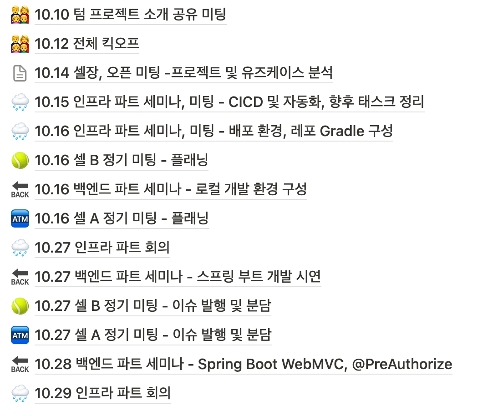
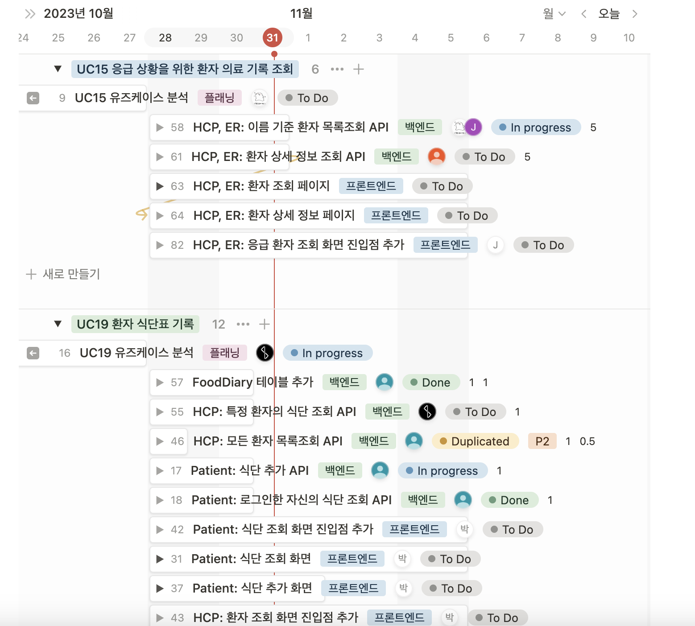
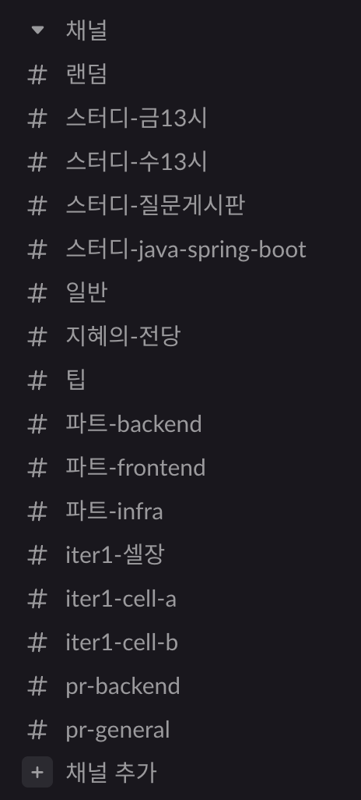

# 협업 도구

## GitLab

`return this;`

## Notion

- 미팅 로그, 회의록, 문서 등을 보관합니다.
- 백로그를 운영합니다.

## Slack

- 메신저, 기록 보관 용도로 활용합니다.
- 모든 채널은 공개이며, 모두가 자유롭게 드나들 수 있습니다.

## Zoom

비대면 회의에 활용합니다.

## Discord

함께 개발해요.

## When2meet

- 일정 조율에 이용합니다.
- 역대 When2meet 목록
  - 킥오프(줌) 일정 <https://www.when2meet.com/?21809814-NLONo>
  - iter1 cell A 정기모임 <https://www.when2meet.com/?21866939-lMHjG>
  - iter1 cell B 정기모임 <https://www.when2meet.com/?21866929-dUqk6>

## Miro

- 화면 및 플로우 설계에 활용합니다.
