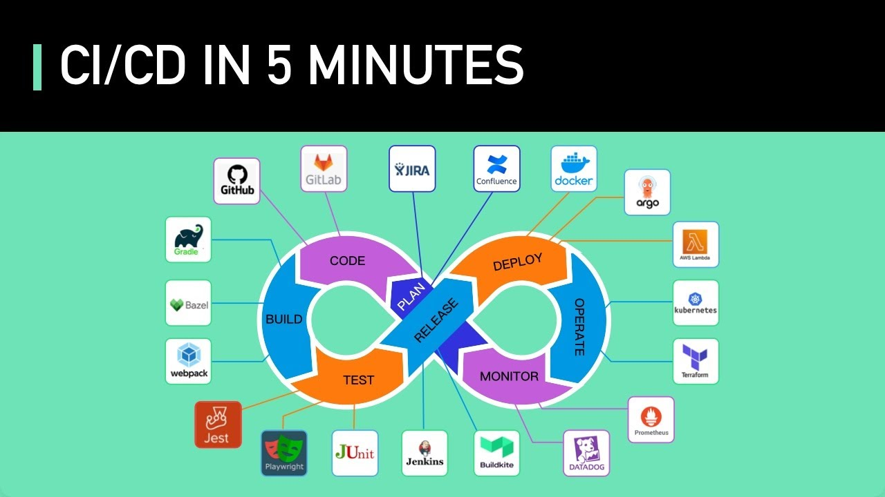

# 10.15 인프라 파트 - CICD 및 자동화 세미나, 향후 태스크 정리

작성: 성현준, 김지안

## 해야 할 일

1. Workflow Integration: 깃랩 슬랙 노션 통합하기
2. Deployment: 서버 배포하기
3. Continuous Deployment: 배포 자동화하기
4. Continuous Integration: 코드 포맷, 테스트 등 자동화하기

## CI/CD란?

Continuous Integration, Continuous Delivery

배포과정(매 이터레이션)마다 plan→code→build→test→release→deploy→operate→monitor을 하게 되는데, 이 과정을 최대한 많이 자동화하는 과정.

Code Request가 하나가 만들어졌을 때, 통합 테스트, 스타일 테스트를 통과하는지.

CI: Build, Test, Release (개발관점이 더 가깝다. 개발자들이 직접 할 때도 많다)

CD: Release, Deploy, Operate (운영팀에서 쓰인다)

## 각종 툴 설명

개발 사이클 각 **단계별 툴**

- plan - jira(이슈 트래커), confluence/노션(문서 관리 툴)
- code- 깃랩, 깃헙
- build - gradle, maven(빌드 자동화 툴, 컴파일과 빌드 서버 실제 시동, 라이브러리 링킹 등을 커맨드 하나로 자동화)
- test
- release - jenkins(유명한 cicd툴)
  - *요즘은 (깃헙)액션, (깃랩)파이프라인이 jenkins의 역할을 일부 가져옴
- deploy- docker, lambda 등 배포 플랫폼
- operate - 쿠버네티스(리소스, 서버 관리 툴), terraform(인프라를 aws gui가 아니라 코드로 관리(자동화가 수월해지는 등의 장점,) iac(infra as code))
- monitor

### 툴 세부설명

Gradle, Maven: [Build automation 툴](https://en.wikipedia.org/wiki/Build_automation)이라고 부름. Compile, Build, Server 실행을 자동화해서, 개발자가 별도로 컴파일하지 않아도 커맨드 한 줄만 치면 알아서 되게 함. 라이브러리/의존성/패키지도 관리해줌.

Test Library Tool: Jest, Playwright, JUnit. 시스템이 돌아가는지 테스트하는 것.

Jenkins: 전통적인 CI/CD 툴. 서버들에 deploy하거나, 자동화 툴으로 유명.

ArgoCD: 쿠버네티스 자동 배포 툴

Lambda: 배포 플랫폼.

Kubernetes: 서버들을 오케스트레이션하는 툴. 몇개의 서버가 필요한지 관리해주는 툴.

Terraform: 인프라를 코드로 관리할 수 있게 해주는 것. Infra as Code (IaC)

## 요즘 트렌드

GitHub, GitLab에 올라가면 바로 실행되게 github actions나 gitlab pipeline을 쓴다.

`$ ./gradlew check`을 돌리면

- 우리가 작성한 Test Code를
- Gradle에 자동화된 방법(컴파일, 빌드, 테스트, 커버리지 측정 등이 자동화됨)으로 알아서 돌리고
- 에러 메시지 및 커버리지를 레포트로 뱉어낸다.

이걸 잘 파싱해서 개발자에게 코멘트해주는 것이 우리 관심사

Test Coverage→몇 프로로 설정할지? 예: Coverage를 100을 넘지 않으면 에러.

## CI/CD 핵심 어젠다: 반복적인 작업을 시스템적으로 자동화하는 것

- 실수의 여지가 줄어듦
- 개발자가 신경쓸 게 줄어서 생산성 오르는 게 체감됨
- 인적자원(개발자의 시간) 관점에서 적은 투자로 많이 아낄 수 있음

## 우리의 CI 테스크

Test Coverage 달성 여부→ 80% 달성했는지?

- ./gradlew check를 돌렸을때 coverage report를 생성하고, 80%를 넘겼는지 확인.
- UnitTest는 gradlew check을 했을때 JUnit과 Jacoco를 사용하고 있기 때문에 될것.
- 통합Test는 Selenium+Cucumber을 활용.

쓰고 있는 라이브러리 및 툴

- Spring Boot: 우리의 메인 프레임워크. Gradle plugin을 제공해줘서 bootJar같은 커맨드들을 만들어줌. `$ ./gradlew bootJar`해도 JAR 파일 빌드가 자동으로 됨
- JUnit: 테스트 라이브러리
- Jacoco: 코드 커버리지 측정 라이브러리
- Gradle: 빌드 자동화 툴

얘네를 사용해서 Gitlab Pipeline에서 커버리지 측정하기.

## 우리의 CD 테스크

- CDK에 깃랩 파이프라인 사용하여 최대한 많은 영역 자동화하기
- 배포 옵션 정리, 환경 구성 배포 완료 이후 → CD로 넘어가기
- 월요일까지 배포 옵션 정리하고, 저녁에 배포 환경 회의
