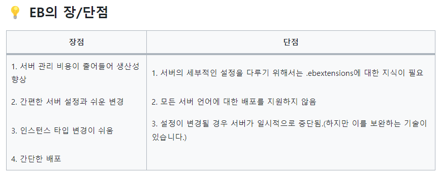

# 10.16 인프라 파트 - 배포 환경 세미나, 레포 Gradle 구성

작성: 김지안

배포 옵션 조사

## 결론

- 아래 내용을 최우선으로 진행하기.
- Elastic Beanstalk에 서버 배포해보기: DB 없어서 실패하더라도 어쨌든 부팅되는 것만 봐도 됨
  - **비용 및 편리성 측면에서 EB를 사용하기로 결정.**
- DB서버 띄우기 (RDS 프리티어로도 충분할 듯)
- 연결정보(DB 비번 등) 전달하는 방법 알아보기 -> AWS Secrets Manager 등

[EB에 SpringBoot 배포(1) - EB 기본 세팅](https://velog.io/@yyong3519/EB에-SpringBoot-배포1-EB-기본-세팅)

## 조사 내용 요약

## **1. EC2 (Elastic Compute Cloud)**

- **관련 서비스**: RDS (데이터베이스 관리), ALB (로드 밸런서)
- **장점**:

1. 제어: EC2 인스턴스의 OS, 네트워크, 스토리지 등을 완전히 제어할 수 있다.
2. 유연성: 원하는 애플리케이션, 미들웨어, OS를 선택할 수 있다.
3. 확장성: Auto Scaling 그룹을 사용하여 자동으로 EC2 인스턴스를 확장/축소할 수 있다.

- **단점**:

1. 관리: OS 및 네트워크 설정, 보안 패치 등 인스턴스 관리가 필요
2. 비용: 사용하지 않는 리소스에도 비용이 발생할 수 있다.

- 다른 툴과 병행 방법:
  - **Docker**: EC2 인스턴스에서 Docker를 실행하여 컨테이너화된 애플리케이션을 배포
  - **Kubernetes**: EC2 클러스터에서 직접 Kubernetes를 설정하고 관리하거나, EKS 서비스를 사용하여 관리형 Kubernetes 클러스터를 실행
  - **Jenkins**: EC2에서 Jenkins 서버를 설정하고, CI/CD 파이프라인을 구축
  - **Terraform**: EC2, RDS, ELB 등의 AWS 리소스를 프로비저닝하고 관리하는 코드를 작성
- **예상 비용**: t2.micro 인스턴스 (Free Tier를 벗어난 경우)
  - Linux: 약 $0.0116/시간
  - 3주간 (504시간) 비용: 약 $5.84

## **2. ECS (Elastic Container Service)**

Docker 컨테이너를 쉽게 실행, 중지 및 관리할 수 있게 해주는 AWS의 서비스

- **관련 서비스**: Fargate, RDS, ELB, ECR
- **ECS 기본 장점**:
    1. 컨테이너 기반: Docker 컨테이너를 사용하여 애플리케이션을 실행
    2. 서버리스 옵션: Fargate를 사용하면 서버 관리 없이 컨테이너를 실행할 수 있습다.
    3. 확장성: 애플리케이션의 수요에 따라 자동으로 확장/축소
- **ECS 기본 단점**:
    1. 비용: Fargate는 EC2보다 상대적으로 비싸다고 느낄 수 있다.
- 다른 툴과 병행 방법:
  - **Docker**: ECS 작업 정의에서 Docker 이미지를 지정하여 컨테이너를 실행
  - **Kubernetes**: 사용하지 않는다. ECS는 AWS의 컨테이너 오케스트레이션 서비스임.
  - **Jenkins**: Jenkins 파이프라인에서 Docker 이미지를 빌드하고, ECS 서비스로 배포
  - **Terraform**: ECS 클러스터, 서비스, 작업 정의 등의 리소스를 프로비저닝하고 관리
- **예상 비용**: Fargate 사용 시
  - vCPU: $0.04048/시간
  - 메모리: $0.004445/GB-시간
  - 3주간 비용 (0.5 vCPU, 1GB 메모리 기준): 약 $43.62

## **3. Elastic Beanstalk**

[[AWS] Elastic Beanstalk 이란?](https://velog.io/@yulhee741/AWS-Elastic-Beanstalk-이란)

**정의**: 애플리케이션과 서비스를 쉽게 배포하고 확장할 수 있는 AWS의 플랫폼

- **관련 서비스**: EC2, RDS, ELB
- **Elastic Beanstalk 기본 장점**:
    1. 확장성: 애플리케이션의 수요에 따라 자동으로 확장/축소
- **Elastic Beanstalk 기본 단점**:
    1. 제한성: Elastic Beanstalk의 기본 설정 외의 커스텀화가 제한적일 수 있다.

- 다른 툴과 병행 방법:
  - **Docker**: Elastic Beanstalk Docker 플랫폼에서 Docker 이미지를 사용하여 애플리케이션을 배포
  - **Kubernetes**: 사용하지 않는다. Elastic Beanstalk는 AWS의 PaaS 서비스임.
  - **Jenkins**: Jenkins 파이프라인에서 Elastic Beanstalk로 애플리케이션을 배포한다.
  - **Terraform**: Elastic Beanstalk 애플리케이션 및 환경의 리소스를 프로비저닝하고 관리한다.
- **예상 비용**: Elastic Beanstalk 자체의 추가 비용은 없지만, EC2, RDS, ELB 등의 서비스를 사용하면 해당 서비스의 비용이 발생한다.
  - EC2 t2.micro 인스턴스 비용 포함: 약 $5.84 (3주간)

## 4. EKS(Elastic Kubernetes Service)

[[AWS] AWS ECS 및  EKS 개념 정리](https://bosungtea9416.tistory.com/entry/AWS-AWS-ECS-및-EKS-개념-정리-EC2-방식-Fargate-방식)

- Amazon EKS는 Kubernetes 애플리케이션을 쉽게 배포, 관리 및 확장할 수 있도록 AWS에서 제공하는 완전 관리형 쿠버네티스 서비스
- **장점**:

1. **완전 관리형 서비스**: AWS가 컨트롤 플레인 및 데이터 플레인의 서버를 자동으로 관리
2. **확장성**: EKS는 애플리케이션의 수요에 따라 자동으로 확장
3. **안정성**: AWS 인프라의 고가용성과 내결함성을 활용하여 쿠버네티스 클러스터를 운영
4. **보안**: AWS의 보안 서비스와 통합되어 있어, VPC, IAM, Security Groups 등을 사용하여 클러스터를 보호
5. **커뮤니티와 호환성**: EKS는 표준 Kubernetes API 서비스를 제공하여 기존 도구 및 플러그인과 호환

- **단점**:

1. **비용**: EKS는 컨트롤 플레인에 대한 비용이 추가로 발생하며, 노드 그룹(EC2 인스턴스)의 비용도 별도로 청구
2. **복잡성**: 쿠버네티스 자체의 학습 곡선이 있으며, EKS의 특정 기능 및 AWS와의 통합에 대한 이해도 필요

- **예상 비용:**
  - **EKS 클러스터**: 약 $0.10/시간
  - **노드 그룹**: 사용하는 EC2 인스턴스 유형에 따라 다르며, t3.medium 인스턴스를 예로 들면 약 $0.0416/시간
