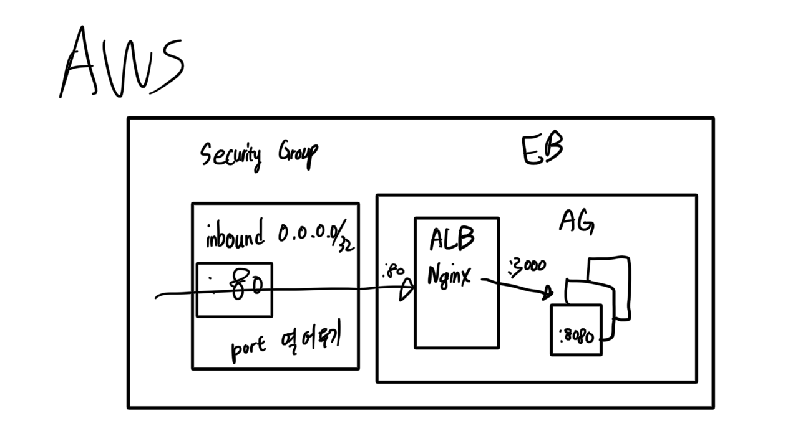

# 10.27 인프라 파트 미팅

## 현준

일반적인 순서:

1. push
2. merge request
3. ***coverage test (pipeline)***
4. after merge into develop

- coverage test를 하기 위해서 gitlab pipeline을 사용.
- compile/build

해야할 것

1. coverage test

    Test Coverage 달성 여부→ 80% 달성했는지?

2. JDK setup (github actions 기준)
3. ./gradlew check를 돌렸을때 coverage report를 생성
    - UnitTest는 gradlew check을 했을때 JUnit과 Jacoco를 사용하고 있기 때문에 될것.
    - 통합Test는 Selenium+Cucumber을 활용.
4. merge request에 코멘트 남기기
5. 80%를 넘겼는지 확인.  넘기지 못하면 pipeline status를 fail로

**2023/10/31(화)까지**

Merge Request를 했을 때, 해당 Merge Request에 comment를 하나를 달아주는 기능. Bot? Gitlab CLI에서 yml파일을 수정해야 됨.

```yaml
# Github Actions 예시

jobs:
  measure_coverage:
    concurrency:
      group: ${{ github.workflow }}-${{ github.ref }}
      cancel-in-progress: true
    runs-on: ubuntu-latest
    steps:
# checkout
      - uses: actions/checkout@v3

# set up JDK
      - name: Set up JDK
        uses: actions/setup-java@v3
        with:
          distribution: 'corretto'
          java-version: 17

# create **coverage report** using ./gradlew check which runs all tests
      - name: Generate kover coverage report
        run: ./gradlew check

# parse coverage report into publish unit test results (EnricoMi)
      - name: Publish Unit Test Results
        uses: EnricoMi/publish-unit-test-result-action@v1
        with:
          files: "**/build/test-results/**/*.xml"

# Add coverage report to PR
      - name: Add coverage report to PR
        id: kover
        uses: mi-kas/kover-report@v1.5
        with:
          path: ${{ github.workspace }}/build/my-project-report/result.xml
          token: ${{ secrets.GITHUB_TOKEN }}
          title: Code Coverage
          update-comment: true
          min-coverage-overall: 100
          min-coverage-changed-files: 100
          coverage-counter-type: LINE

# Refuse Merge Request if coverage fails up to 100 (ours: 80%~95%?)
      - name: Check min-coverage
        id: check_coverage_overall
        if: steps.kover.outputs.coverage-overall < 100
        run: |
          echo "Error: Overall code coverage is below the minimum threshold."
          exit 1
      - name: Check min-coverage-changed-files
        id: check_coverage_changed_files
        if: steps.kover.outputs.coverage-changed-files < 100
        run: |
          echo "Error: Code coverage for changed files is below the minimum threshold."
          exit 1
```

Merge Request가 만들어질 때, 파이프라인 체크 실행이 되어야 한다. (병합이 되기 전)

Difference between Gitlab Pipelines and Jobs?

Not much. Both Gitlab CICD.

- check out Pipeline Editor

## 지안

예시 JAR 파일:

[spring-boot-study-ch2-0.0.1-SNAPSHOT.jar.zip](https://prod-files-secure.s3.us-west-2.amazonaws.com/97143298-64f8-4ed2-a9f3-1000d3da545e/40f2ac1a-34cc-454d-aa4f-202a70b4eafa/spring-boot-study-ch2-0.0.1-SNAPSHOT.jar.zip)

*jar파일이 서버가 바로 실행 가능한 상태로, ElasticBeanstalk에 업로드 가능하다.*

EB



- 오타: inbound CIDR는 0.0.0.0/0
- 보안 그룹이 설정될텐데, 만약 안되어 있다면, inbound의 모든 위치(모든 아이피)에 80port 열어두는 것 체크
- 앞쪽에 ALB(←이 웹서버가Nginx를 연다.)있음. 뒷단에 서버 그룹(오토 스케일링 그룹← 우리는 하나만 띄울 예정이긴 함.)
- ALB 서버가 3000인가 5000인가 아무튼 엶.(Nginx가 바라보는 포트 넘버) 우리 서버는 8080 포트에서 열림. 그래서 둘이 안 맞아서 안 열림 →yml에서 코드를 수정해서 직접 맞춰주거나, 환경변수로 ALB의 뒷단에 열리는 포트를 바꾸어 줄 수 있다. 아니면 환경변수로 yml의 8080을 무시하고, 바꾸어줄 수 있다.

Freetier

- 계정 새로 만들어서 무료로 사용하기.

스프링부트 스터디 ch2꺼 쓰면 되고
