# 인프라 Deploy 인수인계

- 진행 상황 및 조사해둔 자료 정리
- 팀 노션 11.07 회의록 하단에서 분리

## EB 배포

- EB environment 생성
    - application과 envieonment 이름 작성
    - Platform - java (이하 설정은 default 그대로)
    - application code
        - sameple application(연습용)
        - upload your code(스프링부트 빌드 후 생긴 ***plain이 안 붙은 jar 파일*** 업로드)
    - Presets은 single instance(free tier eligible)로 진행하였음
    - service access(role 설정)
        - Use an existing service role
            
            
            
        - 만약, 배포 중 ***해당 service role이 존재하지 않는다는 오류***가 생길 경우, 로그에서 말하는 role과 같은 이름으로 role을 만들어주면 해결된다.

           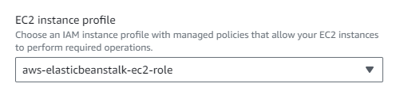
            
    - Instance settings- subnets은 웬만하면, 두 개 이상 체크하기(한 곳에 문제가 생기면 다른 subnets을 이용할 수 있도록)
    - Enable database는 off해두었다. RDS를 사용하여 스프링부트에서 직접 연결할 것이라고 생각하였기 때문이다.
    - Auto scaling group- 여러 대의 인스턴스(서버)를 띄워 로드밸런서로 요청을 분산시키고 싶다면, Single instance에서 Load balanced로 변경하고, 이하 설정도 원하는 대로 수정한다.
    - Environment properties-SERVER_PORT 5000추가(아래 nginx port 설정 참고)

       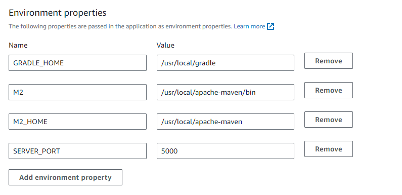
        

## nginx port 설정

- 만약, 배포 후 ***502 Bad Gateway(nginx)라는 오류***가 생긴다면?

    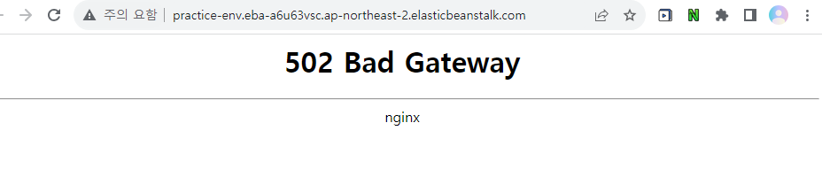
    
- 오류 원인: ALB(로드 밸런서)는 5000 port를 연다. 즉 Nginx가 바라보는 port number가 5000인데, 이 서버는 8080포트에서 열리기 때문에, 불일치로 생긴 문제이다.
- 해결 방법:  yml에서 코드를 직접 수정해주거나, 환경 변수로 yml의 8080 무시하기, 환경변수로 ALB 뒤에 열리는 port number 바꾸기가 있다.
- 환경변수에 SERVER_PORT 5000을 추가하여 해결한다.

    
    

## RDS
(※ 연결 마무리는 인수인계 이후 완수됨)
- database 인스턴스 생성
    - choose a database creation method-standard create
    - Engine options-MySQL
    - Templates-Free tier
    - DB instance identifier -이름짓기
    - Master username/Master password- db연결을 위해 필요, 비공개되어야 한다.
    - Public access-db와 편하게 연결하려면 yes
    - Additional configuration-Inital database name-이걸 안 쓰면, RDS가 db instance가 생성될 때 database를 만들지 않는 것 같다.
- 스프링부트 적용
    - build.gradle
        
        ```java
        implementation 'com.mysql:mysql-connector-j'
        ```
        
    - application.yml
        
        ```java
        spring:
          datasource:
            url: jdbc:mysql://(엔드포인트):(포트번호 3306)/(식별자)?serverTimezone=UTC
            driver-class-name: com.mysql.cj.jdbc.Driver
            username: (username)
            password: (password)
        ```
        
- DBeaver 적용
    - 새 데이터베이스 연결하기 - sql선택 - 로컬호스트 부분에 rds 엔드포인트 입력- username, password 입력.
- Too many connections(커넥션 관리)
    - 현상: DB관리 툴에 연결하거나 DB와 연결된 새로운 서비스를 배포할 때, “too many connections”가 뜨며 RDS를 이용하지 못하게 될 수 있다.(아래 connection이 꽉차있을 것)

        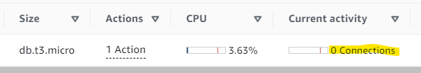
        
    - 원인: 각 rds 인스턴스마다 연결할 수 있는 최대 횟수(max_connection)에 한계가 있기 때문에 오류가 발생한 것이다. 이 값은 RDS 메모리(ex. t3.micro)에 따라 달라진다.
    - 해결: AWS Console-RDS-파라미터 그룹으로 가서, max_connection 파라미터 값을 올린 새로운 파라미터 그룹을 생성하고, 해당 RDS 인스턴스의 파라미터 그룹을 새로 생성된 그룹으로 변경하고, 데이터베이스 재부팅을 진행한다.

        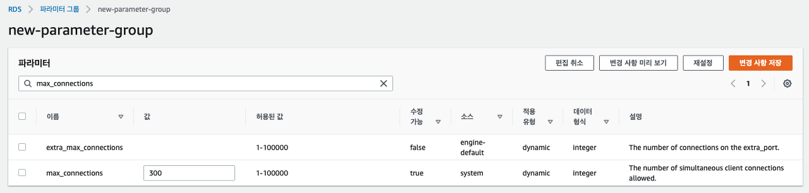

        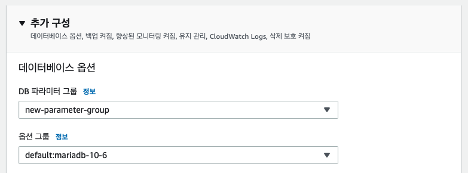
        
    - 혹은 이미 연결되어 있는 connection을 일부 없앨 수도 있다.
    - (파라미터를 수정해줄 때, wait_timeout도 함께 조정해줄 수 있다. 클라이언트가 실제로 사용하지 않더라도, 이 값 동안 DB는 계속 커넥션을 붙잡고 있다. → 이는 비효율적이므로 줄여주는 것도 좋다.)
- Security Group(Inbound, outbound)
    - RDS 인스턴스와 연결이 불가능할 경우(cmd에서 ping을 보내는 것도 실패한다면), security group 문제일 수 있다. (←보안 그룹 설정이 현위치에서의 연결을 허용하지 않는 것)
    - AWS 콘솔 - 해당 database- Security-VPC security groups-Inbound rules-Edit inbound rules→아래와 같은 rule을 추가해준다.(source는 anywhereIPv4를 선택했는데, 0.0.0.0/0이라 custom도 무관)

      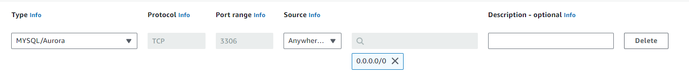        
- Restoring at specific time
    - RDS database 인스턴스는 특정 시점마다 스스로 백업한 snapshot을 만든다.
    - 혹은 원하는 시점에 사용자가 직접 snapshot을 만들어둘 수 있다.
    - 만약 과거 특정 시점의 database 내용물을 확인하고 싶다면, 해당 database instance나, 그 database로 부터 생성된 snapshot를 통해 ‘Restore to point in time’을 할 수 있다.

    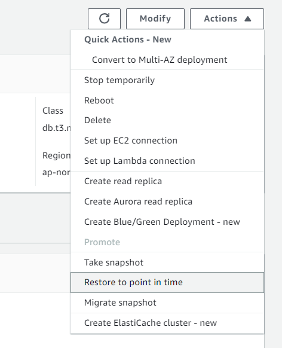    
    - 그러면, 해당 시점의 내용물을 그대로 가진 db 인스턴스가 생성된다. → 이것을 연결하여 내용물을 직접 확인 및 관리 툴을 이용하여 원하는 db로 내용물을 옮길 수 있다.
    - 주의: 따로 원하는 시점의 snapshot을 남겨두지 않는 이상, restore할 수 있는 시점을 완전히 자유롭게 설정할 수는 없으므로, 데이터 백업의 주된 방법으로 사용하는 것으로는 옳지 않다고 생각한다. (하루 이틀 이전 db 정도는 웬만하면 원하는 대로 백업되는데, 좀 더 예전 내용물은 더이상 저장되어 있지 않아 확인하기 어려웠다.)
    - 주의: 이 방식으로 생성된 db 인스턴스도 똑같이 비용이 나가므로, 더이상 필요 없다면 바로 삭제해야 한다.

## IAM

- 한 계정(루트 계정)의 AWS 리소스를 다른 사람들도 공유할 수 있도록 IAM 계정을 만들 수 있다.
- Root 계정 MFA 설정(현재 적용되어 있다.)
    - AWS 콘솔- IAM-루트 계정 MFA 추가 - 가상 인증 앱 다운 등의 방식 중 하나를 골라 진행.

        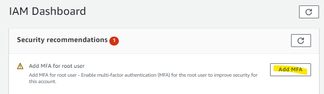

        [IAM - 다중 인증](https://aws.amazon.com/ko/iam/features/mfa/?audit=2019q1)
        
        [[AWS] AWS MFA 설정](https://doing7.tistory.com/29)
        
- IAM 계정 생성+(모든) 권한 추가(현재 두 개의 IAM 계정을 공유 중이다.)
    - IAM-Users-Create User
    - User name 작성
    - Provide user access to the AWS Management Console(optional이지만 선택함)-Usertype은 ‘I want to create an IAM user’로 선택했다.
      - Console password-직접 지어도 되고, 자동생성해도 된다. 나중에 IAM 계정사용자가 처음 접속할 때 비밀번호를 바꿀 수 있다.
        - Set permissions- 아래 옵션을 선택하고, permissions policies에서 해당 IAM 계정 사용자에게 주고 싶은 Root 계정에 관한 권한을 선택한다.
            - Administrator Access는 Root의 모든 리소스에 관한 권한을 IAM에게 허가한다.
            - IAMUserChangePassword는 IAM 계정 사용자가 비밀번호를 바꿀 수 있도록 한다.(아래 단계에서 따로 선택하지 않아도 자동으로 추가됨)

            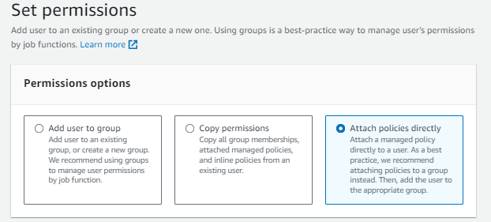

            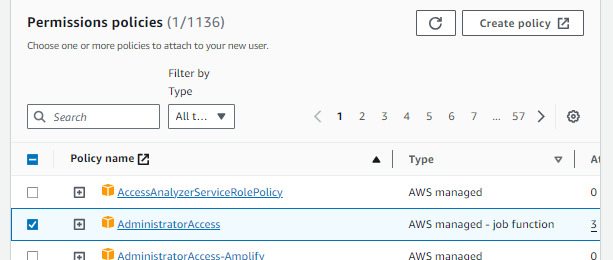    

            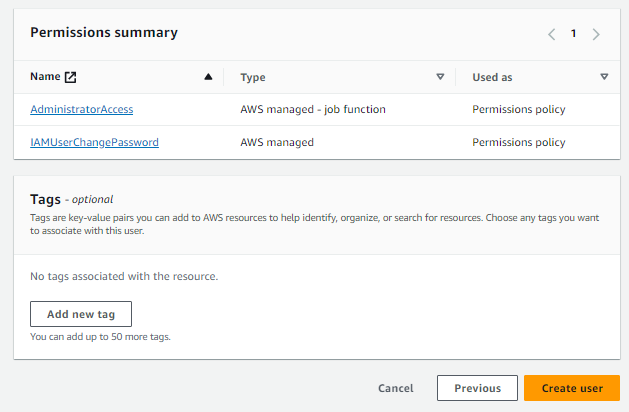

    - 이후 생성된 csv 파일의 링크에 접속해서 IAM용 id와 password를 입력하면 사용할 수 있다.

## **Secrets Manager**

- RDS의 username& password처럼 프로젝트에 작성해야 하지만, 외부로 유출되어서는 안되는 정보를 관리해준다. (github에 편하게 올릴 수 있게끔 가려준다.)
- 생성(RDS의 경우)
    - 보안 암호 유형-RDS 데이터베이스에 대한 자격 증명
    - 보안 암호 이름과 설명(선택사항) 작성, 이름은 보통 “(개발 or 운영 환경)/(어플리케이션이름)”으로 구성한다. ex. dev/myapp
    - 자동 교체 구성- 자동 교체 비활성화(암호를 수명 주기에 따라 자동교체 할지 여부 결정)
- 적용
    - IAM access key 발급
        - IAM 계정에서 진행하기 위해, ***SecretsManagerReadWrite policy가 필요하다.***(현재 두 개의 IAM 계정에 모두 추가되어 있다.)

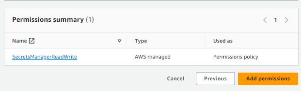        
        - 이후 aws configure에 필요한 액세스 키를 발급받는다.(User 선택-Security credentials-Access key-create a access key)
    - AWS Command Line Interface (CLI) 설치(이미 되어있다면 건너뛰기)
        - AWS CLI는 python으로 작성되었기 때문에 먼저 python이 시스템에 설치되어 있어야 한다.
        - pip install awscli
        - aws --version (설치 확인)
    - 로컬 환경에 AWS credentials 설정(터미널에)
        
        ```java
        aws configure
        
        AWS Access Key ID: your_access_key
        AWS Secret Access Key: your_secret_access_key
        Default region name: us-west-1
        Default output format: json
        ```
        
    - 이후 dependency를 추가하고, 보안 암호를 생성할 때 받은 샘플 코드를 이용하여 적용한다.
        
        [AWS Secrets Manager로 애플리케이션에서 RDS 자격증명 정보 보안하기](https://southouse.tistory.com/8)
        
        [AWS Secrets Manager 개념 및 테스트](https://happy-jjang-a.tistory.com/105)
        
    

## Budget

- AWS 요금 관리를 위해, 사용자가 직접 주기적으로 Billing 내역을 확인하는 것 외에도, 예산안 한도를 미리 정해두는 Budgets 기능을 사용할 수 있다.
- AWS Billing-Bugets-Overview-Create budget
    - Templates-Monthly cost budget으로 선택했다.
    - Budget name, budgetd amount, Email recipients
- 만약 미리 정해준 예산 한도를 넘는다면 budget을 만들 때 기입한 이메일들로, 알림이 온다.(85%등으로 알림 시기를 조절할 수 있다.)
- 현재 팀 프로젝트용 계정에 월 50$를 예산안으로 생성해두었다. 70%, 100%에 도달할 경우, 인프라 팀원의 (gitlab에 올린) 메일로 알림이 전송된다.

  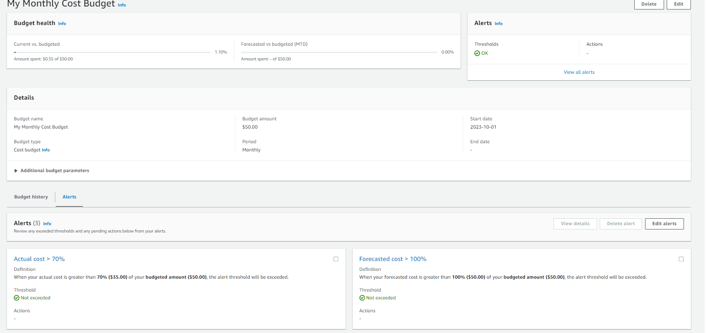
    

## Healthcheck

- EB는 applicaion 상태 모니터링을 진행한다. health check를 통과해야 상태 확인 초록불이 뜬다.

  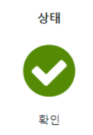
    
- 필요성:
    - 서비스의 고가용성, 고성능을 위한 부하 분산 등의 이유로 서버 다중화를 진행한다면, 앞에서 어떤 서버로 요청을 보낼지 라우팅 역할을 하는 ‘로드 밸런서’를 둔다.
    - 즉, 로드 밸런서가 적절히 부하를 분산(분산 기준은 aws에서 정할 수 있음)하여 여러 서버 중 한 대에게 클라이언트의 요청을 보낸다.
    - 하지만 여러 서버 중 한 대 이상이 서비스 불가 상태이거나, 소스 코드를 로딩하고 있는 상태라면? → 해당 서버로는 요청을 보내선 안된다. 정상적인 서비스가 불가능한 상태이기 때문에, 장애를 유발할 수 있다.

  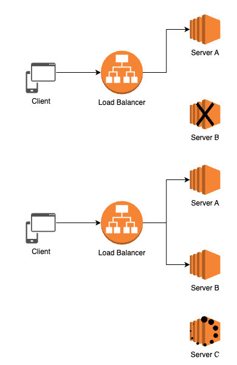
        
    - 따라서 로드 밸런서는 각 서버의 healthcheck API(api 경로는 자유롭게 설정 가능)를 호출해서 해당 서버가 현재 서비스 가능한 상태인지 아닌지 주기적으로 점검해야 한다.
    - → ***healthcheck는 정상적으로 서비스가 가능한 서버에만 트래픽을 보내서 서비스의 고가용성을 확보하는데 도움***이 된다.
- 적용
    - EB는 기본적인 헬스 체크 기능을 자동으로 제공하지만, 보다 세밀한 헬스 체크를 위해서 추가로 로직을 구현할 수 있다.
    - 예시 code(스프링 부트 프로젝트 안에 삽입)
        
        ```java
        
        import org.springframework.http.ResponseEntity;
        import org.springframework.web.bind.annotation.GetMapping;
        import org.springframework.web.bind.annotation.RestController;
        
        @RestController
        public class HealthCheckController {
        
            @GetMapping("/healthCheck")
            public ResponseEntity<String> healthCheck() {
                // 여기서 실제 서비스의 건강을 체크하는 로직을 추가할 수 있다.
                // (ex.데이터베이스 연결을 확인하거나 필요한 외부 서비스와의 연결 등 체크)
                // 정상이면 200 OK 응답을 반환한다.
        
                //return ResponseEntity.ok("Status is OK!");
        				return "200 OK";
            }
        }
        ```
        
    - EB에 적용
        - EB의 모니터링 옵션은 Basic/ Enhanced 두 가지이다.

          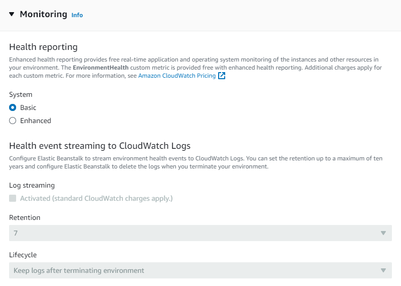
            
            - Basic- 기본적인 빈스톡에 대한 상태를 컬러로 확인, 로드 밸런서를 통한 health check 지원
            - Enhanced- Basic에서 제공하는 것들+basic과 다르게 환경 리소스에 대하여 추가적으로 정보를 수집하고 이를 CloudWatch에서 상세하게 볼 수 있다.(cloudWatch는 로그를 확인할 수 있어 유용하지만, 추가 요금이 나간다.)
        - API URL 변경
            - 로드밸런싱을 설정하는 곳에서 health check url을 수정할 수 있다.
            - default는 ‘/’이고, 위의 예시 같은 경우에는 ‘/healthCheck’로 바꾸어주어야 한다.
                
                [Basic health reporting - AWS Elastic Beanstalk](https://docs.aws.amazon.com/elasticbeanstalk/latest/dg/using-features.healthstatus.html)
                
                [How do I set the health-check URL on an Elastic Beanstalk instance in a AWS CloudFormation template?](https://stackoverflow.com/questions/47753168/how-do-i-set-the-health-check-url-on-an-elastic-beanstalk-instance-in-a-aws-clou)
                

## ACM과 Route53(https)

- ACM과 Route53을 이용하여 사설 도메인 HTTPS(SSL) 등록하기
- Route53에 사설 도메인 등록하기
    - CNAME 값을 등록해주기 위해 Route53-Hosted zones-Create hosted zone 생성
    - 사설 도메인 관리 페이지에서, Route53 호스팅 영역에서 확인할 수 있는 ***NS레코드의 라우팅 대상 4개***를 넣어준다.(마지막에 .은 제거하고 넣는다.)
    - 소유자 인증을 마지고 적용을 누른다.
- ACM(AWS Certificate Manager)에서 SSL(TSL) 인증서 발급받기(구매한 도메인에 대한 보안 인증서 발급)

  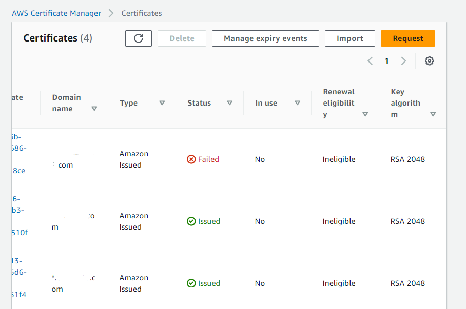
    
    - Certificate Manager→Request a certificate(인증서 요청)
    - Certificate type-Request a public certificate(SSL/TLS)
    - 도메인 이름-*.(도메인 이름)을 해주면 앞에 어떤 값을 붙여서든 하위 도메인을 생성할 수 있다.(ex. www.(도메인 이름))
    - 도메인 소유 인증방식 선택(DNS검증방식(CNAME 레코드 생성 제공) or 이메일 검증 방식)
    - 생성시 Pending Validation 상태가 된다.
- Route53에 도메인 CNAME값 등록
    - ACM 항목에서 Create records in Route53 버튼을 통해,  생성된 Route53 호스팅 영역에 CNAME 값을 등록한다.

  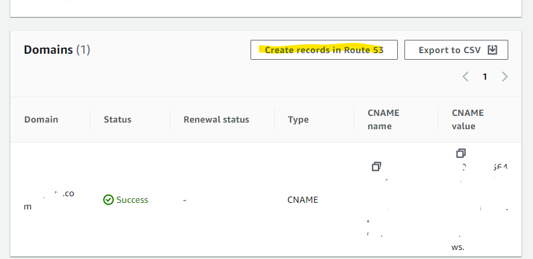
    
- ACM이 Pending Validation에서 성공(발급됨)으로 잘 변경되는지 확인한다.
- 이후 route53에서 로드밸런서에 대한 A레코드를 등록하고, EB에서 리스너(https 443)를 추가한다.

[EC2 HTTPS로 연결하기 (2) - 로드밸런서로 리다이렉트 설정하고 Health check 통과하기](https://woojin.tistory.com/94)

[ACM/SSL 인증서를 로드 밸런서에 연결](https://repost.aws/ko/knowledge-center/associate-acm-certificate-alb-nlb)

[Configure HTTPS for Elastic Beanstalk environments](https://repost.aws/knowledge-center/elastic-beanstalk-https-configuration)

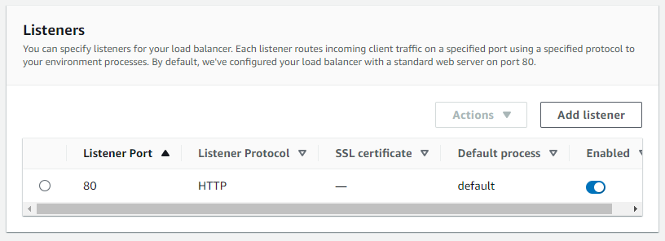

## Hello-cdk

- AWS CDK(Cloud Development Kit)는 클라우드 애플리케이션 리소스를 모델링 및 프로비저닝(IT 인프라를 생성하고 설정하는 프로세스) 해주는 도구이다.(개발자가 사용하는 프로그래밍 언어로 AWS 인프라 관리를 지원)

[CDK로 AWS 인프라 구축하기 - #1 CDK 둘러보기](https://ongamedev.tistory.com/486)