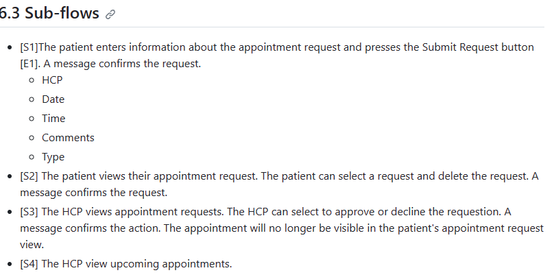
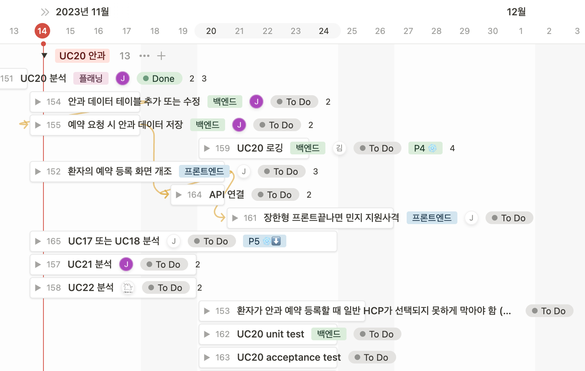

# 11.13 셀 A 정기 미팅 - UC20 플래닝

## UC 20 안과 예약 요청

화면

- [환자] 안과 예약/안과 수술 예약 요청 페이지
- [환자] 예약 요청 조회 페이지 (+ 예약 삭제)
- [검안사/안과의사 HCP] 예약 요청 조회 페이지 (+ 예약 승인/거절)
- [검안사/안과의사 HCP] 곧 임박한 예약 조회 페이지

기능

- [환자] 안과 예약 요청 조회/생성/삭제
- [검안사/안과의사 HCP] 안과 예약 요청 조회/승인/거절

공수

- **'UC 6 예약'**의 연장선상 -> 기존 구현된 페이지에 수정만 하면 될 듯?
- 아예 페이지를 새로 추가해야 하더라도 기존 페이지 참고하면 어렵지는 않을 것으로 예상

## Flow

- [S1] 환자가 request 날리는 페이지 ([기존에 있던 페이지](http://localhost:8080/iTrust2/patient/manageAppointmentRequest))
  - 각 의사 종류 별 받을 수 있는 request
    - APIEnumController에 user의 role에 따라 가능한 AppointmentType list를 return하는 함수가 이미 존재
    - Ophthalmologist HCP
      - General checkup
      - ophthalmology appointment
      - ophthalmology surgery appointment
    - optometrist HCP
      - General checkup
      - ophthalmology office visits
  - 필수 기입란
    - HCP
      - HCP user name
    - Date
    - Time
    - Type
      - General checkup/ophthalmology appointment 체크
- [S2] Patient
  - 자신의 appointment request status를 확인 가능
    - 기존에는 pending medical appointment만 확인이 가능했음

            

  - 자신의 appointment request를 삭제 가능
- [S3] ophthalmologist HCP
  - View appointment request
    - approve/decline request
  - Appointment request를 approve/decline 하면 patient는 더이상 볼 수 없음
- [S4] ophthalmologist HCP
  - View upcoming approved appointments

## Frontend

이미 있는 페이지를 조금씩 바꾸는 정도의 task가 될 것 같습니다.

### 1. 환자

Appointments → Manage Appointment Request 페이지를 이용할 수 있을 것 같습니다.

- Appointment 신청
  - Ophthalmology appointment를 선택하면 아래의 field가 필요합니다.
  - 필수로 기입해야 하는 정보는 형광펜으로 표시했습니다.

        | Field        | Format                                                            |
        | ------------ | ----------------------------------------------------------------- |
        | HCP          | Ophthalmologist HCP User's name from the system. Required         |
        | Date         | 2 digit month/2 digit day/4 digit year. Required                  |
        | Time         | 2 digit hour:2 digit minutes[space][am or pm]. Required           |
        | Comments     | Up to 50 characters                                               |
        | Type         | One of "General Checkup" or "ophthalmology appointment". Required |
        | Name         | Up to 250 alphanumeric characters, '-' allowed                    |
        | Abbreviation | Up to 10 alphanumeric characters, '-' allowed                     |
        | CPT Code     | 5 digits beginning with 90                                        |
        | Comments     | Up to 500 characters                                              |

  - 필수 기입란을 기입하고, 모든 입력값이 format과 일치할 경우 성공 메시지를 출력합니다.
    - format과 일치하지 않을경우 에러메세지 출력합니다.

- Patient의 Appointment request를 모두 띄워줍니다.
  - 기존 Appointments → Manage Appointment Request랑 똑같음
  - 기존에는 pending medical request만 보였었는데, status를 볼 수 있다는 것은 환자가 request한 모든 request를 띄워놓고 status를 바꿔야할 듯(백엔드에서 변경하는거네)
    - The patient can view the status and delete their appointment requests

### 2. HCP

- 기존의 HCP가 Appointment request를 처리하는 것과 동일합니다.
  - Appointment request를 approve/decline 합니다.
  - 승인된 upcoming appointment를 확인할 수 있습니다.

## Backend

1. appointment_request 데이터베이스의 column이 추가되어야 합니다. 추가되어야 할 column은 다음과 같습니다. 추가되는 column은 null이어도 됩니다.
    - comments 이름이 겹쳐서 다른 이름 써야 할 것 같습니다.

    | Name         | Up to 250 alphanumeric characters, '-' allowed |
    | ------------ | ---------------------------------------------- |
    | Abbreviation | Up to 10 alphanumeric characters, '-' allowed  |
    | CPT Code     | 5 digits beginning with 90                     |
    | Comments     | Up to 500 characters                           |
2. appointment_request DB에서 값을 가져오는 API를 개발합니다.
    - 로그인 주체가 patient인 경우
        - 해당 patient의 pending request를 모두 가져옵니다.
            - 이미 짜여져 있는 거 쓰면 됨

    - 로그인 주체가 HCP인 경우 2가지가 필요할 것 같습니다.
        - approve/decline 하기 위해 status가 pending 인 값을 가져옵니다.
        - 승인된 upcoming appointment를 확인하기 위해 status가 approved이고 date가 지금보다 이후인 값을 가져옵니다.

1. appointment_request DB에 값 저장하는 API를 개발합니다.
    - 기존의 코드를 이용할 수 있을 것 같습니다.
        - 확장된 column에 따른 변경이 필요할 것 같습니다.

## 화면 설계

[A private Miro board](https://miro.com/app/board/uXjVNafaHRQ=/)

## 논의 사항

- ophthalmology surgery appointment를 어떻게 처리할 것인가
  - 얘가 Main Flow에서 딱 한번 나오고 그 뒤로 단 한번도 안나옴
  - Sub flow는 물론이고 Logging, Data format에서 Type에도 surgery는 없음..
    - 또 이상한건, 지금 구현되어 있는 거에 있는 Type에는 ophthalmology surgery appointment가 있다는 점..

- 추가된 필드들을 보는 화면이 없음
  - approve 화면에서 안 뜨는 건 나름 합리적임. 예약을 승인할 때 보통 타입, 스케줄, 누구인지 정도만 보므로.

## 백로그 이슈 발행 및 배정

