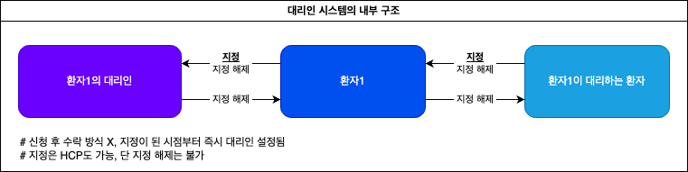
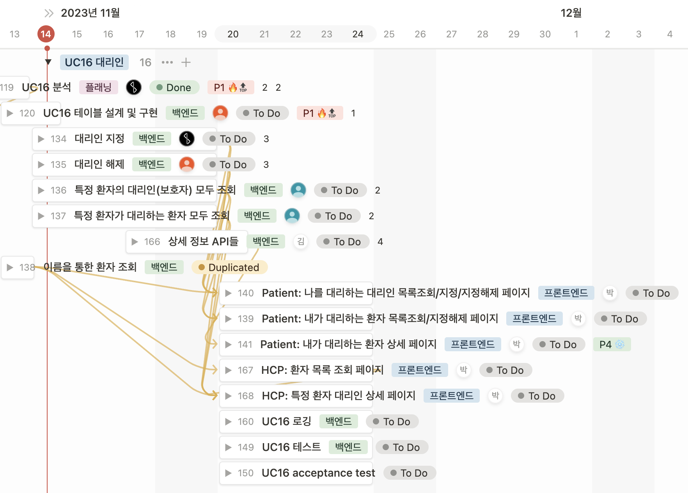

# 11.13 셀 B 정기 미팅 - UC16 플래닝

## 요구사항 분석

### 환자

- 자기가 누구의 PR인지 리스트를 볼 수 있음.
- 누가 나의 PR인지 리스트를 볼 수 있음.
- 다른 유저를 자신의 PR로 지정 또는 지정해제할 수 있음.
- 자신이 더 이상 다른 유저의 PR이 아니게끔 스스로 지정해제할 수 있음.
(즉 스스로 타인의 보호자를 자처할 수는 없음, 단 지정되었을 때 거부는 가능)

### HCP

- 환자 하나를 다른 환자의 PR로 지정할 수 있음.
- 특정 환자의 PR이 누구인지 리스트를 볼 수 있음.
- 특정 환자가 누구의 PR인지 리스트를 볼 수 있음.



---

## Frontend

### 1. 환자

- personal representatives page - 나를 대리해줄 PR(나의 대리인) 조회 페이지

```
1. PR 지정
    a. 'Declare a Representative' 옵션 누르면 이름 입력창 표시
    b. 입력창에 부분/전체 MID(== 환자 이름) 입력하면 만족하는 환자 리스트 표시(like 쿼리문)
    c. 그 중 한명 선택해서 'Confirm Declaration' 선택 가능
        - 환자가 없는 경우에 대해 에러메시지 표시할 것(그 사이에 admin이 삭제했다던가? 어떤 케이스를 상정한건지는 잘 모르겠음)
        - 성공하면 성공 메시지 표시, 리스트 갱신

2. PR 지정 해제
    a. 'Undeclare Representatives' 선택 후 PR 하나 선택하면 PR 지정해제
        - The patient can hit "Undeclare representatives", select a PR and remove them as a PR. → 여기도 애매함
        왜 representatives로 복수형인데 한번에 한 명만 지정해제 가능하게 되어있는지?
    b. 성공하면 메시지 표시, 리스트 갱신
```

- personal representatives page - 내가 PR로 등록된 환자 조회 페이지

```
1. 만약 내가 이 사람 대리인하기 싫다 하면, 리스트에서 이름 선택해서 자기 자신을 지정해제 할 수 있음.

2. 성공하면 메시지 표시 → 문서엔 따로 언급 없긴 한데 여기도 리스트 갱신 해야겠지?
```

### 2. HCP

- 모든 환자 리스트(UC19 때 코드 복붙)
- 특정 환자의 PR 리스트 조회 페이지(이 환자의 PR인 환자는 누구인가?)
  - 특정 환자에게 PR을 추가하는 페이지
  - 별도의 페이지를 개발하기보다는 그냥 위 환자 파트의 PR 지정 폼 그대로 복붙해서 사용
- 특정 환자가 대리하고 있는 환자 리스트 조회 페이지(이 환자가 PR인 환자는 누구인가?)

---

## Backend

### 1. DB 구축

PR 테이블 만들어야 함. (column명 공모 대환영)

| Patient | PR     |
| ------- | ------ |
| 환자명  | 환자명 |
| 환자명  | 환자명 |
| …       | …      |

간단한 테이블이니 금?방 할듯

### 2. API 개발

총 6개의 API 개발 필요 (모든 환자 리스트 조회 API는 기존꺼 사용)

- 공통 -

1. PR의 이름이 주어지면 해당 PR이 대리중인 모든 환자 조회하는 API → parameter: PR 이름
2. 환자의 이름이 주어지면 해당 환자를 대리중인 모든 PR 조회하는 API → parameter: 환자 이름

- 환자로 로그인한 상태에서 -

1. 환자 본인이 자신의 PR을 지정하여 추가하는 API → parameter: PR 이름
2. 환자 본인이 자신의 PR을 지정 해제하는 API → parameter: PR 이름
3. 자신이 대리중인 환자를 지정 해제하는 API(== 대리 거부) → parameter: 환자 이름

- HCP로 로그인한 상태에서 -

1. HCP가 특정 환자에게 PR을 추가하는 API → parameter: 환자 이름, PR 이름

---

## 컨펌받을 요소

1. Acceptance Scenarios 중 2번을 보면

    ```
    **Scenario 2: View the health records of an assigned patient** (Precondition: Jill has logged in)::Jill logs in to the iTrust2 system, Jill navigates to the list of her assigned patients and selects Billy Bob, Jill is taken to a page where she can view the access logs of Billy, Jill can navigate to the medical records, diagnoses, and appointments page
    ```

    갑자기 뜬금없이 PR은 자기가 대리하고 있는 환자의 access logs, medical records, diagnoses, appointments 총 4개의 페이지에 접근할 수 있어야 된다고 한다. 본문에는 일언반구도 없던 내용이다가 갑자기 등장해서 상당히 당황스러운데, 하진피셜 어렵지 않을거라고 하니 이거까지 구현할지 (아직 저거까지 고려해서 분석을 못써서 여기에 남겨요)

    → 일단 우선순위 낮춰서

2. HCP는 환자에게 PR 지정이 가능한데, 지정 해제는 불가능한 상황. 지정 해제도 필요할까?

    → 사서 고생하지 말자

3. 화면/플로우 설계

    → (선개발 후리버싱)

## 백로그 이슈 발행 및 배정


