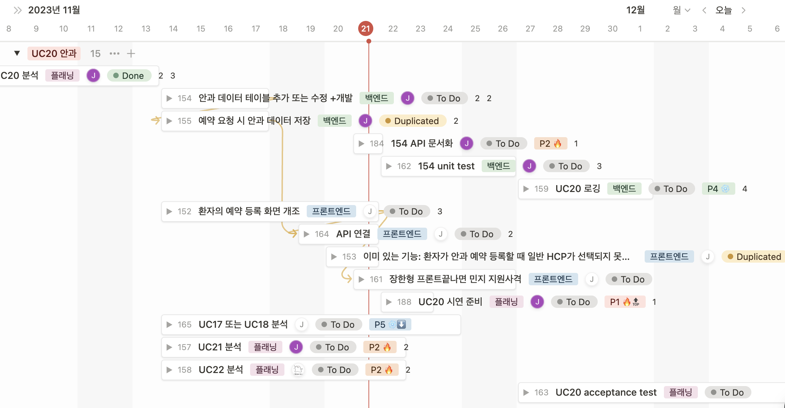

# 11.20 셀 A 정기 미팅 - 스크럼 미팅 및 플래닝

## 인원 재편성

- 지안: 셀 A → 셀 B 지원사격

## 발표 계획

> Our upcoming project demo session for the second iteration is scheduled for 11/21 (Tue) and 11/23 (Thu). The demonstration sequence will proceed in reverse order, starting with Teams 8(+6+3), 7 (Tuesday), and Teams 5, 4, 2, 1 (Thursday).
>
>
> Each team is allocated a timeframe of 20-25 minutes to allow for effective presentations, accommodating at least two teams per hour. While the demo format offers flexibility, it is crucial to comprehensively cover all relevant details related to the evaluation criteria outlined in the project documentation (except for a new UC proposal). I encourage you to involve several team members in the presentation and to showcase the implementation of UCs through videos or real-time demonstrations on your local machine.
>
> Your adherence to these guidelines is highly appreciated, ensuring a smooth and enlightening demonstration session.
>

공통

- 시간은 토탈 25~30분, 알아서 길어지는걸 감안해서, 인당 3분
- 자료는 필요하면 기존에 노션에 올려둔 거 짜집기 → 깃랩에 올리기 추천 (바로 마크다운으로 복붙 가능)
- 쇼케이스 넣기랑 최대한 많은 인원이 발표에 참여하면 좋다는 교수님의 칙령

편성

- 인프라
  - (각자 성과, 프로그레스, 계획 발표)
  - 지안: AWS IAM MFA, RDS 서버 생성 및 연결, EB 배포 시연
  - 현준: HTTP, HTTPS 연결, CICD 시행착오, K8s 계획
- iter1 cell a uc15
  - 상헌: 시연 및 요구사항 부합 검증
- iter1 cell b uc19
  - 정현: 시연 및 요구사항 부합 검증
- iter2 cell a uc20
  - 설계, 진행상황, 남은 계획 공유
  - 정양: (가능하면) 시연 및 요구사항 부합 검증
- iter2 cell b uc16
  - 설계, 진행상황, 남은 계획 공유

## 이슈 현황 공유 및 재배정

