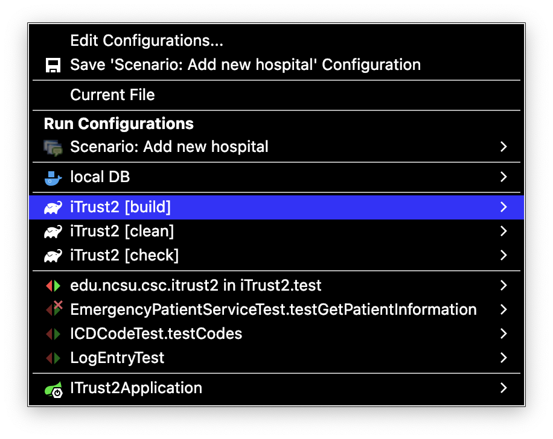
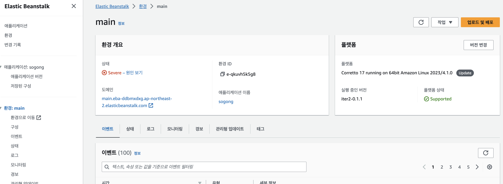
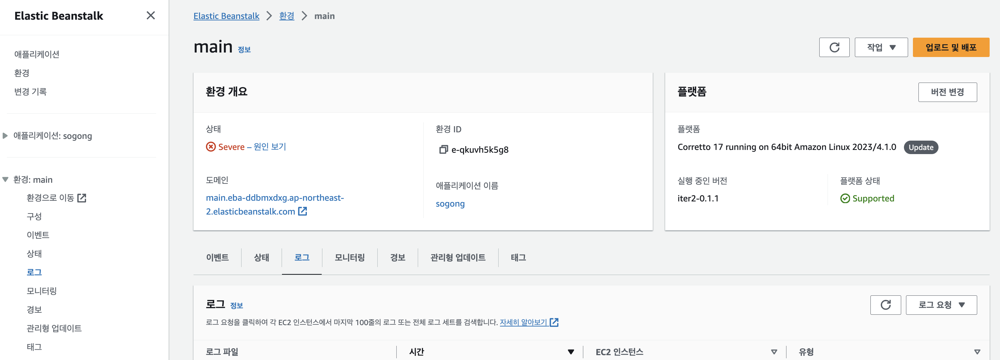

# 11.30 인프라 파트 미팅 - 진행 상황 공유

인프라 인원 편성 방안: 1명은 백엔드 지원, 다른 1명은 인프라 마일스톤 수행

## 빌드 및 배포

1. 스프링 부트 빌드 `./gradlew build`
주의: 현재 환경별 데이터베이스 연결 정보 자동 주입이 없어서, `application.yml`에서 연결 정보를 직접 수정해야 함

    

2. `build/libs/` 폴더에 JAR 파일 생성되었는지 확인
주의: 이름 끝에 plain이란 접미사 붙은 애는 무시하기
3. Elastic Beanstalk 콘솔 방문

    

4. 환경 선택
5. 우측 상단의 “업로드 및 배포” 클릭
6. “파일 선택” 클릭 후 빌드된 JAR 파일 선택

    

7. 버전 레이블을 프로젝트 룰에 맞게 입력
8. 배포~

## 오류 로그 수집

1. Elastic Beanstalk 콘솔 방문
2. 환경 선택
3. “로그” 탭 방문

    

4. 오른쪽 하단의 “로그 요청” 드롭다운 → “전체” 클릭
5. 로딩 되면 다운받고 압축 해제
6. `var/log/web.stdout.log` 가 스프링 부트의 표준 출력임. 즉 스프링 부트 켰을 때 콘솔에서 뜨는 형식의 오류는 여기서 찾으면 됨
