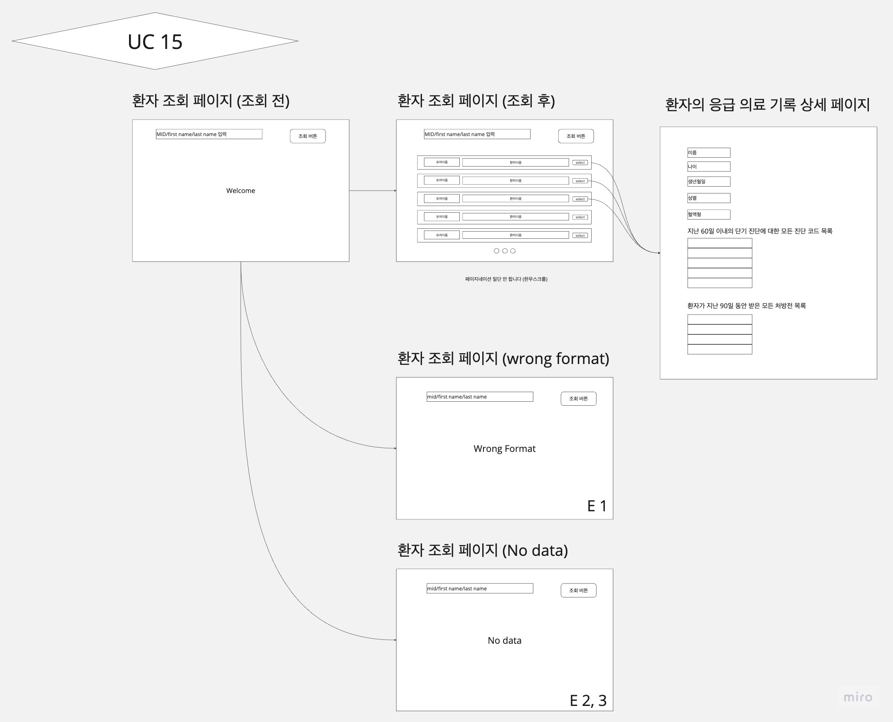
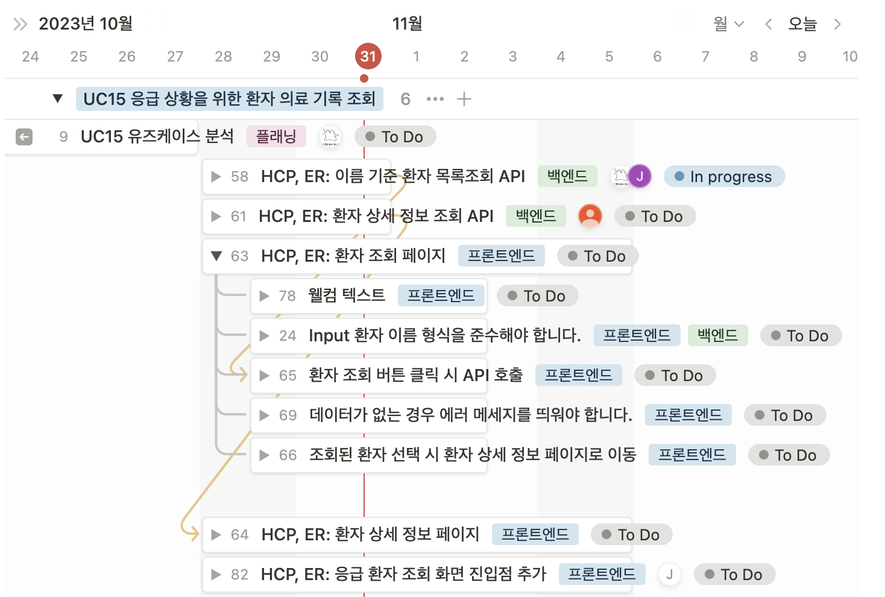

# Cell A - UC15

| 일정        | 내용                 |
| ----------- | -------------------- |
| 10.13~10.16 | 플래닝 및 설계       |
| 10.17~10.26 | 시험기간             |
| 10.27~10.27 | 이슈 발행 및 배정    |
| 10.28~10.31 | 개발   발표 준비 |

## 플래닝 및 설계

### 플래닝

화면

- 환자 조회 페이지 - 조회 후에는 조회된 환자 보여주는 페이지
- 환자의 응급 의료 기록 상세 페이지
  - 이름, 나이, 생년월일, 성별 및 혈액형
  - 지난 60일 이내의 단기 진단에 대한 모든 진단 코드 목록(가장 최근 순으로 정렬됨)
  - 환자가 지난 90일 동안 받은 모든 처방전 목록이 표시됩니다(가장 최근 순으로 정렬).

기능

- FIrst name, Last Name의 substring으로 환자 검색
- MID(username)의 substring으로 환자 검색
- 선택한 환자의 응급 건강 기록 상세 페이지 표시

공수

- 페이지 3개 필요해서 프론트 기능 많이 필요할 수도
- 백엔드는 조회 3개만 있으면 돼서 공수 적을듯

### Frontend

1. 환자 조회 페이지 - 4개로 나눠왔지만 하나의 페이지에 구현할 예정

    1-1.  환자 조회 페이지(조회 전)

    조회할 환자의 FIrst name, Last Name, MID(username) 등을 받아오는 페이지. 입력된 데이터가 아래의 양식에 맞지 않거나 조회된 환자가 없는 경우 에러 페이지로 이동해야 합니다. 양식에 맞고, 조회된 환자 데이터가 존재하는 경우 조회된 환자 데이터를 리스트 형식으로 보여줍니다.

    1-2. 환자 조회 페이지(조회 후)

    조회된 환자의 FIrst name, Last Name, MID(username)를 띄워주는 페이지. 유저 선택이 가능해야 하고, 조회 버튼을 통해 환자의 응급기록 상세 페이지로 이동해야 합니다.

    1-3. 환자 조회 페이지(Error: wrong format)

    입력된 환자의 데이터가 양식에 맞지 않을 경우, 에러 메시지를 띄워주는 페이지.

    데이터의 양식은 다음과 같고, 합집합으로 처리해서 저기의 양식 전부에 부합하지 않는 경우 에러로 처리할 예정

    **Data Format**

    | Field       | Format                                                |
    | ----------- | ----------------------------------------------------- |
    | First Name  | Up to 20 alpha characters and symbols -, ', and space |
    | Last Name   | Up to 30 alpha characters and symbols -, ', and space |
    | Patient MID | Between 6 and 20 alpha characters and symbols - or _  |

    1-4. 환자 조회 페이지(Error: no date)

    입력된 환자의 데이터가 없을 경우, 에러 메시지를 띄워주는 페이지.

조회된 환자의 리스트에서 Select버튼을 누르면 그 환자의 응급기록 상세 페이지로 이동합니다.

1. 환자의 응급기록 상세 페이지

이 페이지는 아래의 데이터를 표시합니다.

- 환자의 응급 의료 기록 상세 페이지
  - 이름, 나이, 생년월일, 성별 및 혈액형
  - 지난 60일 이내의 단기 진단에 대한 모든 진단 코드 목록(가장 최근 순으로 정렬됨)
  - 환자가 지난 90일 동안 받은 모든 처방전 목록이 표시됩니다(가장 최근 순으로 정

### Backend

- 1-2. 환자 조회 페이지(조회 후) 에서 사용할 함수

    firstNameSubset, lastNameSubset, userNameSubset이란 서칭하는 함수를 만들어 줘야 할 것 같음 - 인풋값으로 스트링, 리턴값으로 유저네임과 이름의 리스트 리턴

- 2. 환자의 응급기록 상세 페이지 에서 사용할 함수

    환자와 관련된 다음정보를 가져오는 함수 만들어야 함

  - 이름, 나이, 생년월일, 성별 및 혈액형
  - 지난 60일 이내의 단기 진단에 대한 모든 진단 코드 목록(가장 최근 순으로 정렬됨)
  - 환자가 지난 90일 동안 받은 모든 처방전 목록이 표시됩니다(가장 최근 순으로 정렬)

### 화면 설계

<https://miro.com/app/board/uXjVNafaHRQ=/?share_link_id=867136840702>

### 의사결정

- 조회 입력에서 MID와 이름은  통합하기로 - 데이터 포멧이 맞는지 검사는 합집합으로 한다.
- select 버튼 만들기로

### 백로그

## 개발

- 이름 기준 환자 목록조회 API 개발이 리뷰 과정 중입니다.
- 환자 상세 정보 조회 API 개발 진행중입니다.
- 프론트엔드 개발 진행중입니다.
