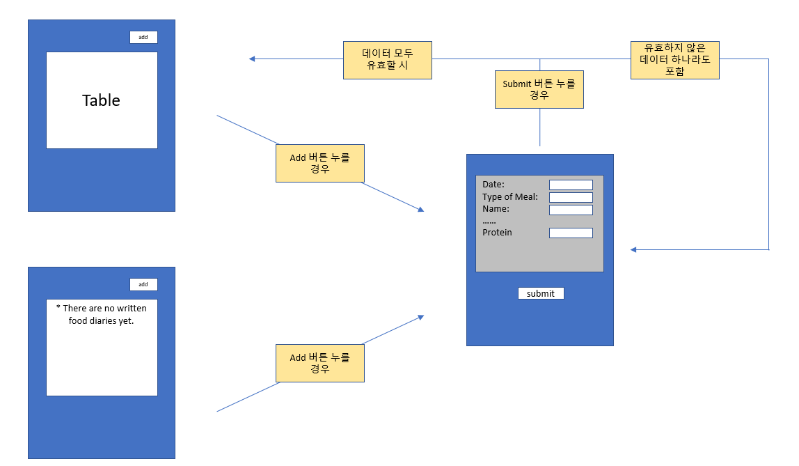
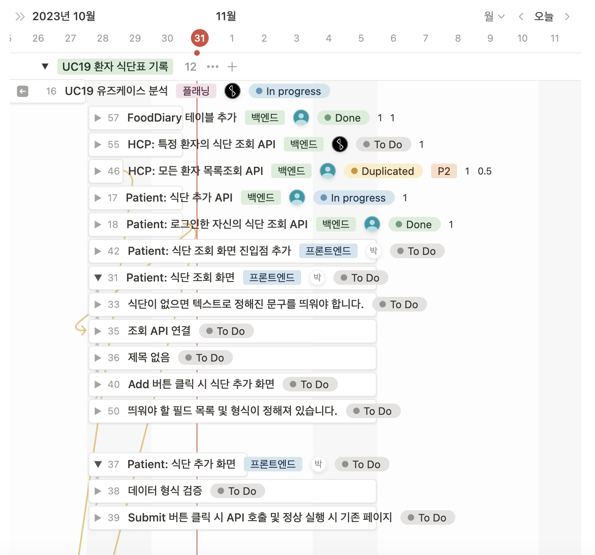
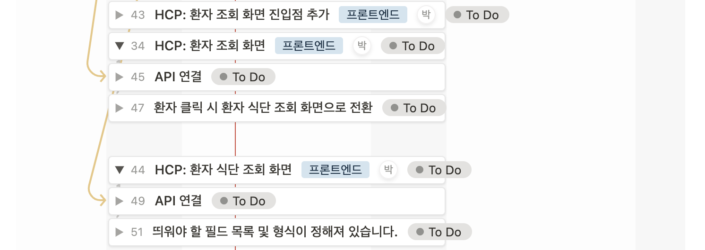

# Cell B - UC19

| 일정        | 내용                 |
| ----------- | -------------------- |
| 10.13~10.16 | 플래닝 및 설계       |
| 10.17~10.26 | 시험기간             |
| 10.27~10.27 | 이슈 발행 및 배정    |
| 10.28~10.31 | 개발 <br/> 발표 준비 |

## 플래닝 및 설계

### 환자 로그인 기준

#### 음식일기 조회

- 모든 음식일기 데이터 전시(최신이 가장 위로 오게끔)
- 모든 음식일기는 각각 총합 계산 데이터가 있어야 함(칼로리) + 표시할 것

#### 음식일기 생성

- 음식일기 작성 폼 전시(프론트 + 백 양측에서 잘못된 입력값 감지)

### HCP 로그인 기준

- 환자 리스트 전시
- 환자 선택시 해당 환자의 음식일기 조회 페이지로 (단 add 불가)

### Frontend

페이지가 총 3~4개 필요합니다. (참고용 이미지 삽입 예정, 추후 figma 등 다른 플랫폼 활용하여 정리할 듯)

#### 1. 로그인 주체가 환자일 경우

```text
1-1. view 페이지
 백엔드 API의 도움을 받아, 로그인한 환자의 음식 일기 정보를 나열하는 페이지. 아마 DB에서 볼 때처럼 똑같이 테이블 형태로 표시하면 될 것 같습니다. 좌상단 쯤에 add new food diary 버튼을 위치시켜서, 누를 경우 후술할 add 페이지로 연결됩니다. 만약 환자가 한번도 음식 일기를 쓰지 않은 사람일 경우, 음식 일기가 존재하지 않음을 나타내는 메세지를 테이블 대신 표시해야 합니다.

1-2. add 페이지
 DB에 넣을 데이터에 맞추어서 form을 표시하는 페이지. 페이지 최하단에는 등록 버튼이 있어야 하며, 누를 경우 모든 form에 대해 input checking을 진행해서 올바르지 않은 데이터가 입력될 경우 reject하고 해당 form 하단에 빨간 경고 문구를 표시하면 좋을 것 같습니다.
 + 추가) 틀린 필드가 복수로 존재할 경우, 동시에 alert를 모두 표시하는 것으로(requirement 참조)
```


(예상) view 페이지의 테이블 형태



#### 2. 로그인 주체가 HCP일 경우

```text
2-1. patient 선택 페이지
 우선 UC19 docs에 나온 대로라면, HCP는 모든 환자의 음식 일기에 접근할 수 있습니다. 따라서 1 column짜리 테이블 형태로 환자명을 쭉 나열하는 페이지가 필요하며, 해당 이름을 선택할 경우 후술할 view 페이지로 연결됩니다. 환자는 이름순으로 정렬하면 될 것 같습니다.

2-2. view 페이지
 환자의 view 페이지와 완전히 동일하나, add 버튼 하나만 비활성화되어있으면 됩니다. 환자의 view 페이지를 그대로 쓰되, 로그인 정보를 바탕으로 활성화/비활성화 여부를 정하는 방식으로. (이렇게 할 경우 사용자가 임의로 페이지 소스를 수정해서 버튼을 활성화시켜서 누를 수도 있을 텐데, 이건 API상에서 걸러내는 걸로. 이게 가능한지 + 바람직한지 잘 몰라서 팀장 컨펌 필요)
```

### Backend

- 음식 일기 데이터베이스 구축을 먼저 해주세요. column들은 다음처럼 하시면 될 것 같습니다. 참고로 전부 required field입니다.(=null 불가)

    ```jsx
    1. patientName: 환자 이름
    2. date: 날짜, mm/dd/yyyy 포맷이며 오늘 + 과거 날짜로만 설정 가능하게끔
    3. mealType: “Breakfast”, “Lunch”, “Dinner”, “Snack” 중 하나
    4. foodName: null 또는 빈칸 불가
    5. servingsNum: 양수
    6. caloriesPerServing: 0 또는 양수
    7. fatGramsPerServing: 0 또는 양수
    8. sodiumMilligramsPerServing: 0 또는 양수
    9. carbsGramsPerServing: 0 또는 양수
    10. sugarsGramsPerServing: 0 또는 양수
    11. fiberGramsPerServing: 0 또는 양수
    12. proteinGramsPerServing: 0 또는 양수
    13. fatGramsTotal: 0 또는 양수, calculated column -> 1회 제공량에 servingsNum을 곱한 값, 이하 전부 동일
    14. sodiumMilligramsTotal: 0 또는 양수, calculated column
    15. carbsGramsTotal: 0 또는 양수, calculated column
    16. sugarsGramsTotal: 0 또는 양수, calculated column
    17. fiberGramsTotal: 0 또는 양수, calculated column
    18. proteinGramsTotal: 0 또는 양수, calculated column
    ```

- 이후 해당 DB에서 값을 가져오는 API 개발을 진행해주시면 됩니다.
  - parameter로 patientName이 주어지면, 해당 환자에 해당하는 데이터를 전부 가져오면 될 것 같아요.
  - 암시적 parameter로 로그인 정보가 있는데, 이건 logging 시 transaction code 구분에 사용될 겁니다.
- 또한 프론트 페이지에서 해당 DB로 값을 입력하는 API도 필요합니다.
  - parameter로 patientName + form의 input 값들을 주면 DB의 table에 값을 insert하게끔 해야 합니다.
  - 백엔드 단에서도 데이터 유효성 검사 해야 함 (ex. 로그인 정보가 HCP인데 add 요청이 있을 경우 reject)

### 컨펌받을 요소

1. 음식 일기 view에서 모든 결과값을 계속 나열하는 것은 바람직하지 않으므로 한 페이지에 표시할 수 있는 최대 음식일기 수를 제한을 해야할 듯 싶은데, 한 페이지에 몇 개를 표시하는 것이 적당할 지 → 50개 정도?
2. 환자가 보는 view 페이지와 HCP가 보는 view 페이지는 add 버튼의 활성화 여부를 제외하면 완전히 동일한데, 이것을 동일한 페이지에 로그인 정보에 따른 버튼 활성화/비활성화 처리로 구현할 것인지, 아니면 별개의 페이지로 구현할 것인지(현업의 방식은?) → 전자
3. 교수님이 던져주신 UC에서는 Allowed to have multiple entries for the same meal type이라는 field가 있음. 아마 bool type의 필드일 것 같은데, data format에는 그 내용이 누락되어 있어서 구현할지 말지를 정해야 함. → 일단 제외
4. 음식 일기 add만 있고, delete와 edit이 없는데 이대로 괜찮은가? → 우리는 상남자다

### 백로그




## 개발

- 백엔드 API 개발이 완료되었습니다.
- 프론트엔드 개발 진행중입니다.
