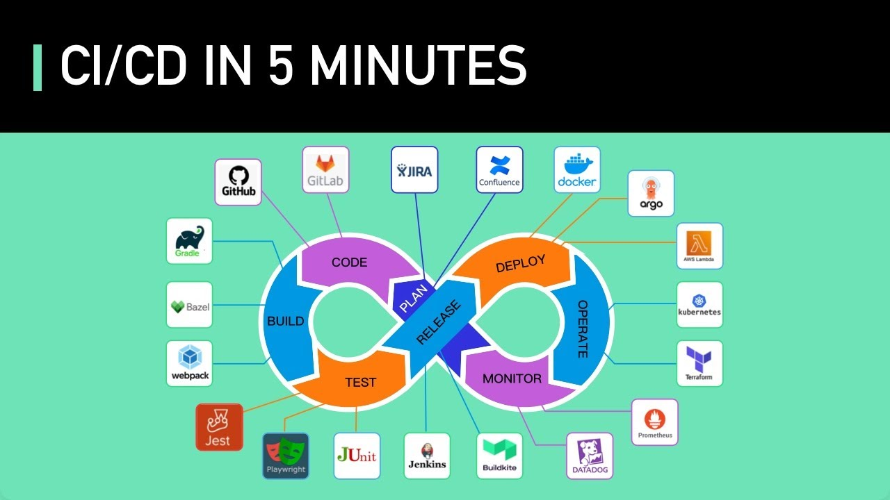
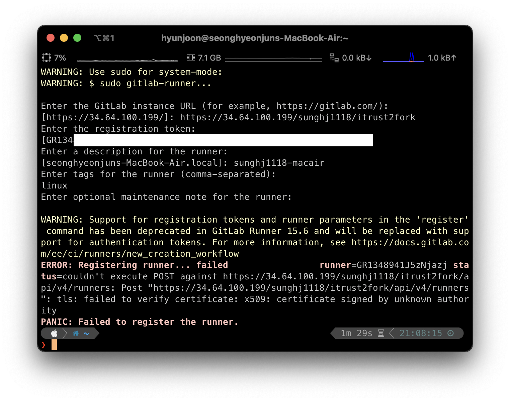
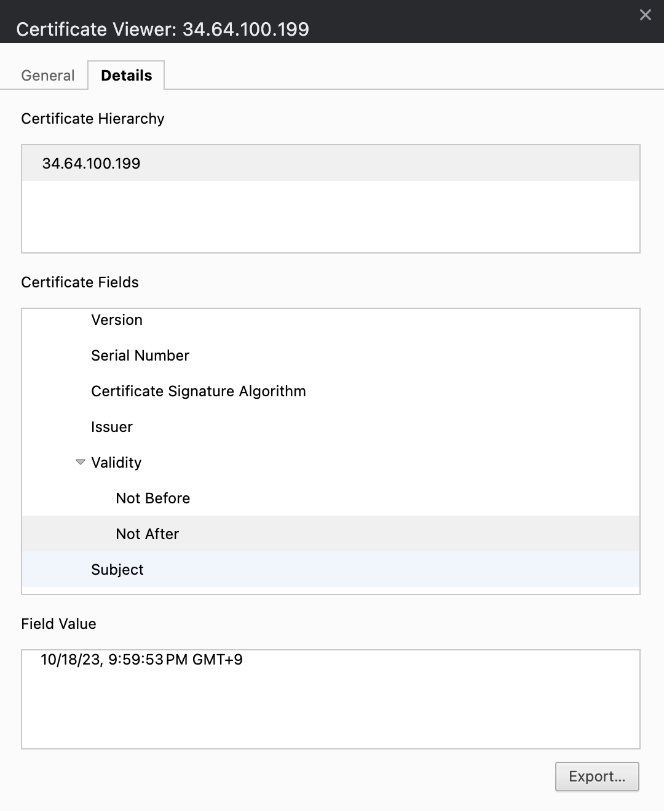
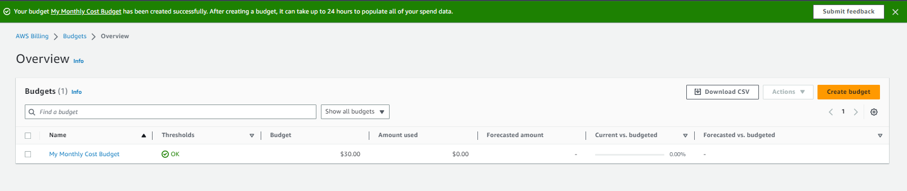
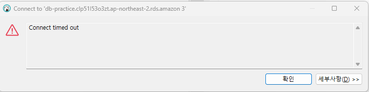
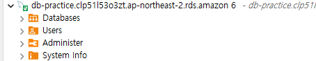

# CI/CD

## CI/CD 개념

Continuous Integration, Continuous Delivery의 약자.

배포과정(매 이터레이션)마다 plan → code → build → test → release → deploy → operate → monitor을 하게 되는데, 이 과정을 최대한 많이 자동화하는 과정.

CIntegration: Build, Test, Release (개발관점이 더 가깝다. 개발자들이 직접 할 때도 많다)
CDelivery: Release, Deploy, Operate (운영팀에서 쓰인다)

<br />
<br />
<br />
<br />

## CI/CD의 목적 및 구체적인 태스크

### CI/CD 핵심: 반복적인 작업을 시스템적으로 자동화하는 것

- 실수의 여지가 줄어듦
- 개발자가 신경쓸 게 줄어서 생산성 오르는 게 체감됨
- 인적자원(개발자의 시간) 관점에서 적은 투자로 많이 아낄 수 있음

### CI 태스크

Test Coverage 달성 여부 → 80% 달성했는지?

- ./gradlew check를 돌렸을때 coverage report를 생성하고, 80%를 넘겼는지 확인.
- UnitTest는 gradlew check을 했을때 JUnit과 Jacoco를 사용하고 있기 때문에 될것.
- 통합 Test는 Selenium + Cucumber을 활용.

### CD 태스크

- CDK에 깃랩 파이프라인 사용하여 최대한 많은 영역 자동화하기
- 배포 옵션 정리, 환경 구성 배포 완료 이후 → CD로 넘어가기

<br />
<br />
<br />
<br />

## 시행착오

### **CI 태스크: Test Coverage 달성 여부**

### _Runner을 써야 하는 이유_

Pipeline Editor을 활용한 .gitlab-ci.yml을 제작/실행을 시도했을 때, 무한 pending 상태가 되었다.


Runner가 없기 때문에 Job이 실행이 안 된다.

**결론→Runner을 써야한다.**

<br />
<br />

### Registration Tokens Deprecated

Runner를 설치/등록하려 했으나, command로 하는 방식은 deprecated.




<br />
<br />

## x509: certificate signed by unknown authority

`x509: certificate signed by unknown authority`

  

<br />
<br />

### **Possible solution: Specify a custom certificate file**

  

  `❯ gitlab-runner register --tls-ca-file=/Users/hyunjoon/34.64.100.199.cer`

  **certificate has expired or not yet valid.**

  인증서 유효기간이 만기되었는지 확인:

  

  인증서 유효기간이 만기되었다.

<br />
<br />

### **Possible solution: Change date to be within certificate expiration**

  x509 Error가 계속 발생하여

  1) cer/crt 파일을 직접 받아서 연결하려 했고
  2) 날짜를 변경해서 유효기간 안으로 맞춰봤으나,

  다음과 같이 다른 에러가 나왔다.

    WARNING: Support for registration tokens and runner parameters in the 'register' command has been deprecated in GitLab Runner 15.6 and will be replaced with support for authentication tokens. For more information, see https://docs.gitlab.com/ee/ci/runners/new_creation_workflow
    
    ERROR: Registering runner... failed                 runner=GR1348941J5zNjazj status=couldn't execute POST against https://34.64.100.199/sunghj1118/itrust2fork/api/v4/runners: Post "https://34.64.100.199/sunghj1118/itrust2fork/api/v4/runners": tls: failed to verify certificate: x509: certificate relies on legacy Common Name field, use SANs instead
    
    PANIC: Failed to register the runner.

  

<br />
<br />

### Gitlab Version

  소공 gitlab은 16.3.3 early access 버전.

  


  따라서 해당 방식으로 project runner이 등록이 되어야 하는데 안되는 상황.

<br />
<br />
<br />
<br />

### CD 태스크: Elastic Beanstalk 배포

### *배포 옵션 조사*

- AWS EC2, ECS, EB, EKS 서비스의 특성 및 장단점을 조사하였다.(10.16회의록 참고)

  → 비용 및 편리성 측면에서 EB를 사용해 배포하기로 결정.

### *Elastic Beanstalk 배포*

- 배포 방법을 확인하고자, 일단 팀 내 스터디에서 빌드한 jar 파일을 사용하였다.
- 비용 관리를 위해 AWS 계정을 새로 만들어 프리티어를 적용받고, AWS budgets를 사용한다.



- EB에서 domain name, platform(java), Create and use new service role 등의 옵션을 선택하고 배포를 완료한다.
- 해당 service role이 존재하지 않는다는 오류가 떴었는데, 사용했던 role 이름으로 하나를 만들어주면 된다.

### *502 Bad Gateway*


- 그런데 문제가 발생했다. 502 Bad Gateway. nginx.
- ALB는 5000 port를 연다. 즉 Nginx가 바라보는 port number가 5000인데, 이 서버는 8080포트에서 열리기 때문에, 불일치로 생긴 문제이다.

→ 해결 방법은 yml에서 코드를 직접 수정해주거나, 환경 변수로 yml의 8080 무시하기, 환경변수로 ALB 뒤에 열리는 port number 바꾸기가 있다.

- 환경변수에 SERVER_PORT 5000을 추가하여 배포한 링크는 아래와 같다.(향후 삭제 예정)

[http://practice-env.eba-a6u63vsc.ap-northeast-2.elasticbeanstalk.com/](http://practice-env.eba-a6u63vsc.ap-northeast-2.elasticbeanstalk.com/)

### *DB와 연결*

- 기존에 사용하던 h2를 MySQL로 변경하기 위해 AWS RDS에서 MySQL 프리티어 인스턴스를 생성한다.
- yml, build.gradle을 수정하여 다시 빌드한다.

`url: jdbc:mysql://(rds 인스턴스 end-point):3306/cheap9?serverTimezone=UTC`

`driver-class-name: com.mysql.cj.jdbc.Driver`

+) username, password 등

`implementation 'com.mysql:mysql-connector-j'`

- 이때 test 폴더에도 yml을 생성해야 하는데, 이는 H2와 MySQL의 차이 때문이다.
- H2(인메모리 데이터베이스): 별도의 설정 없이도 쉽게 사용할 수 있으며, 별도의 데이터베이스 서버를 구동할 필요가 없음
- MySQL(외부 데이터베이스): 테스트 환경에서 사용할 데이터 베이스의 연결 정보 명시가 필요함.

### C*onnect timed out*

- 연이은 빌드 실패로, dbeaver에서는 연결이 잘 되나 보았는데, timed out이 떴다.



- ping을 보낸 결과 100%손실이었고 **Security Groups에서 문제를 발견했다.**


- Security Groups의 Inbound rules에서 source를 수정해준 결과 dbeaver에서 제대로 연결된 것을 확인할 수 있다.



- 당분간 Security Groups 관련 설정, Secrets Manager 등에 관하여 시행착오를 이어나갈 계획이다.

### *Health check*

```java
@GetMapping("/healthCheck")
public String healthCheck() {
    return "200 OK";
}
```
