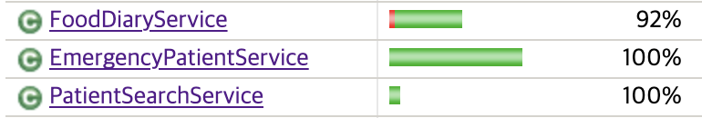
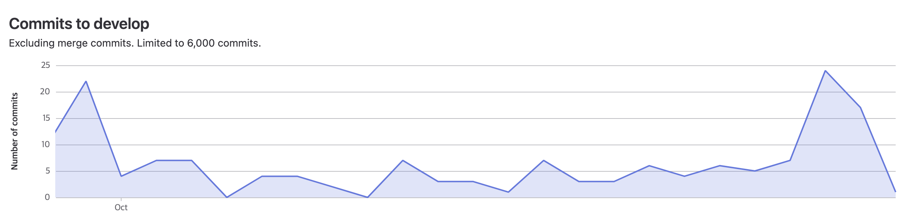
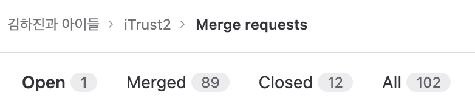
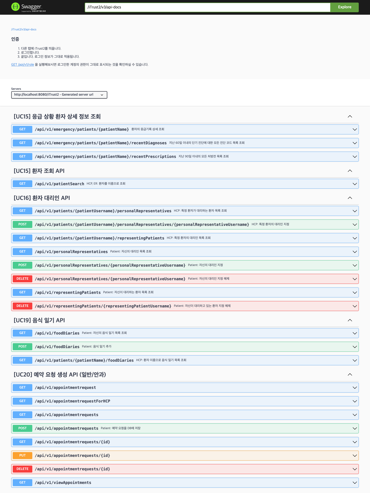

# 11.23 Iteration 2 Demonstration

## 시연

### 발표자 명단

- 김하진
- 윤정현
- 박정양
- 이상헌
- 성현준
- 김지안

### 자료

- <https://sogong.hajin.kim>
- <https://sogong.hajin.kim/iTrust2/swagger-ui/index.html>

## 조직 구성

### 리더십 로테이션

| Iter | Team Lead | Cell A Lead | Cell B Lead | Frontend Lead | Infra Lead |
| ---- | --------- | ----------- | ----------- | ------------- | ---------- |
| #1   | 김하진    | 이상헌      | 윤정현      | 박민지        | 김지안     |
| #2   | 김하진    | 박정양      | 윤정현      | 박민지/윤장한 | 성현준     |
| #3   | 김하진    | 전희재      | 홍세아      | 윤장한        | 성현준     |

모든 구성원이 최소 1회 리더를 맡습니다.
Iter3는 예상 방안입니다.

### 파트 구성

| Iter | 백엔드                                         | 프론트엔드             | 인프라             |
| ---- | ---------------------------------------------- | ---------------------- | ------------------ |
| #1   | 박정양, 윤정현, 이상헌, 전희재, 홍세아         | **박민지**, 윤장한     | **김지안**, 성현준 |
| #2   | 김지안, 박정양, 윤정현, 이상헌, 전희재, 홍세아 | **박민지**, **윤장한** | **성현준**         |

### 셀 구성

| Iter | Cell A                                    | Cell B                                            |
| ---- | ----------------------------------------- | ------------------------------------------------- |
| #1   | UC15 / 박정양, 윤장한, **이상헌**, 홍세아 | UC19 / 박민지, **윤정현**, 전희재                 |
| #2   | UC20 / **박정양**, 윤장한, 이상헌         | UC16 / 김지안, 박민지, **윤정현**, 전희재, 홍세아 |

## Iteration 2 액션 아이템

### 프로젝트 전체 요구사항

- [ ] UC 5개 + 신규 1개 구현
- [x] 정기적 커밋
- [x] 동료 평가
- [ ] JUnit (line?) coverage 80%
- [x] `README.md` 유지보수
- [x] 주간 미팅
- [x] 리더십 로테이션
- [x] 협동

### Iter 1 교수님 피드백

- [ ] UC 제안: 조금 쉬워보일 수도
- [x] UC 제안: 기존 UC와 연관성이 있는지? → 있습니다.
- [ ] 계획 부족해 보임. 실현 가능성 보완하기
- [x] 데모가 없음 → 스웨거, 실제 작동 시연 등 필요할 듯

### Iter 1 회고

- [ ] 조금 더 미리 이슈를 해야 하는데 잘 안 됩니다. (student syndrome) → 데드라인을 명확히 해봅시다.
- [x] 이슈 스케줄, 데드라인이 불명확했습니다. → 플래닝 및 이슈 발행 시 신경씁시다.
- [ ] 질문하는 습관 → 30분룰을 잊지 맙시다.
- [ ] 프로젝트 운영 공부 → 관심있다면 책은 추천해드릴 수도…
- [ ] 셀장에게 자율성을 더 줍시다. (화이팅^^)
- [ ] 각 UC에 대한 대략적인 마일스톤이 있었으면 좋겠습니다.
- [ ] 프론트가 API에 펜딩되는 경우가 빈번합니다. → 백엔드 리드가 신경쓸 수 있게 해보기로
- [x] API 문서를 알아보기 편하게, 특히 파라미터나 반환에 대한 내용이 있었으면 좋겠습니다. → Swagger 보완
- [x] 회의를 주에 1번으로 줄입시다.

## 개발 현황 및 계획

- Iter1: W1 ~ W3 (중간고사 포함)
- Iter2: **W4** ~ **W6**
- Iter3: W7 ~ W10 (기말고사 포함)

|                         | UC15            | UC19            | UC20            | UC16            | UC2?        | UC23 (New) |
| ----------------------- | --------------- | --------------- | --------------- | --------------- | ----------- | ---------- |
| 담당                    | Iter1 Cell A    | Iter1 Cell B    | Iter2 Cell A    | Iter2 Cell B    | Iter3       | Iter3      |
| 분석                    | W1 ~ W3         | W1 ~ W3         | W1 ~ W3         | W1 ~ W3         | W1 ~ W3     | W1 ~ W3    |
| 설계 및 계획            | W1 ~ W3         | W1 ~ W3         | **W4** ~ **W5** | **W4** ~ **W5** | **W6** ~ W7 | W7 ~ W7    |
| 개발: API               | W3 ~ W3         | W3 ~ W3         | **W5** ~ **W6** | **W5** ~ **W6** | W7 ~ W8     | W7 ~ W8    |
| 개발: FE                | W3 ~ **W4**     | W3 ~ **W4**     | **W5** ~ **W6** | **W6** ~ W7     | W7 ~ W9     | W7 ~ W9    |
| 개발: BE-FE 통합        | **W4** ~ **W4** | **W4** ~ **W4** | **W6** ~ **W6** | **W6** ~ W7     | W7 ~ W9     | W7 ~ W9    |
| 개발: Unit test         | **W4** ~ **W6** | **W4** ~ **W5** | **W6** ~ W7     | **W6** ~ W7     | W8 ~ W9     | W8 ~ W9    |
| 개발: Logging, 권한 등  | **W4** ~ **W5** | **W4** ~ **W5** | **W6** ~ W7     | **W6** ~ W7     | W8 ~ W9     | W8 ~ W9    |
| 피드백: 리뷰            | **W4**          | **W4**          | **W6**          | W7              | W9          | W9         |
| 피드백: Acceptance test | W7 ~ W7         | **W5** ~ **W6** | W7 ~ W7         | W8 ~ W8         | W9 ~ W10    | W9 ~ W10   |

### UC15

| 프로세스        | 상태     |
| --------------- | -------- |
| Feature 개발    | 완료     |
| 단위 테스트     | 완료     |
| 제품 리뷰       | 완료     |
| Acceptance test | 계획: W7 |

[이 문서](./uc15.md)에 정리하였습니다.

### UC19

| 프로세스        | 상태 |
| --------------- | ---- |
| Feature 개발    | 완료 |
| 단위 테스트     | 완료 |
| 제품 리뷰       | 완료 |
| Acceptance test | 완료 |

[이 문서](./uc19.md)에 정리하였습니다.

### UC20

| 프로세스        | 상태     |
| --------------- | -------- |
| 설계 및 계획    | 완료     |
| Feature 개발    | 완료     |
| 단위 테스트     | 진행 중  |
| 제품 리뷰       | 진행 중  |
| Acceptance test | 계획: W7 |

### UC16

| 프로세스        | 상태     |
| --------------- | -------- |
| 설계 및 계획    | 완료     |
| API 개발        | 완료     |
| 프론트엔드 개발 | 진행 중  |
| 단위 테스트     | 진행 중  |
| 제품 리뷰       | 계획: W7 |
| Acceptance test | 계획: W8 |

[이 문서](./uc16.md)에 정리하였습니다.

### UC2?

| 프로세스        | 상태     |
| --------------- | -------- |
| 설계 및 계획    | 진행 중  |
| Feature 개발    | 계획: W7 |
| 단위 테스트     | 계획: W8 |
| 제품 리뷰       | 계획: W9 |
| Acceptance test | 계획: W9 |

### UC23 (New)

| 프로세스        | 상태     |
| --------------- | -------- |
| 설계 및 계획    | 계획: W7 |
| Feature 개발    | 계획: W7 |
| 단위 테스트     | 계획: W8 |
| 제품 리뷰       | 계획: W9 |
| Acceptance test | 계획: W9 |

### 인프라 #1

[이 문서](infra-1-distribution.md)에 정리하였습니다.

### 인프라 #2 HTTP, HTTPS, and CI/CD

see documentation [here](infra-http-https-CICD.md)

## 그 외 현황

### 테스트

- Unit test: 백엔드에서 JUnit을 사용하여 테스트합니다. 비즈니스 로직에 대한 instruction coverage 80%를 목표로 합니다.
- Integration test: (보류) 백엔드에서 JUnit Spring Runner를 사용하여 테스트합니다.
- System test: (보류) Cucumber를 사용하여 테스트합니다.
- Acceptance test: 실제 배포 환경에서 직접 테스트합니다.
- TDD: 너무 고난도 및 오버 스펙이어서 적용하지 않았습니다.
  - 혹시 이러한 방법론에 관해 디스커션하는데 관심이 있으시면 컨택 부탁드립니다.  
    <https://github.com/hajin-kim/tdd-study>  
    <https://github.com/hajin-kim/tdd-step-by-step>

- 단위 테스트 instruction coverage 80%를 달성하였습니다.

### 정기적 커밋

- Iteration 2 극후반에 커밋이 늘어났으나, 대체로 정기적으로 커밋하였습니다.
- 이터레이션 초반에 플래닝이 집중되는 이유도 있습니다.

<!-- 깃 컨벤션: iter1 데모 때 소개한 거 이후로는 딱히 채용하지 않음 -->

### 주간 미팅

- 파트별 및 셀별 총합 20회 진행하였고, 모든 구성원이 주 1회 이상 참여하였습니다.
- 11월부터 주 1회 미팅으로 횟수를 줄이되, 플래닝 및 일정 배정에 신경써 개발 퍼포먼스를 유지하고 있습니다.

### API 문서

<https://sogong.hajin.kim/iTrust2/swagger-ui/index.html>

### 리더십 트레이닝

- 팀장은 feature 코드를 작성하지 않습니다.
- 혼자 개발하는 것보다 동료의 성장, 시스템 구축, 문화 전파에 더 힘쓰는 것이 더 효율적이라는 아이디어입니다.

---

Iteration 3, 증분 3도 즐겁게 개발해봅시다~
