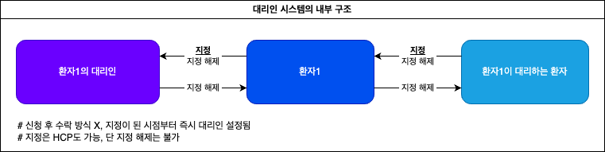
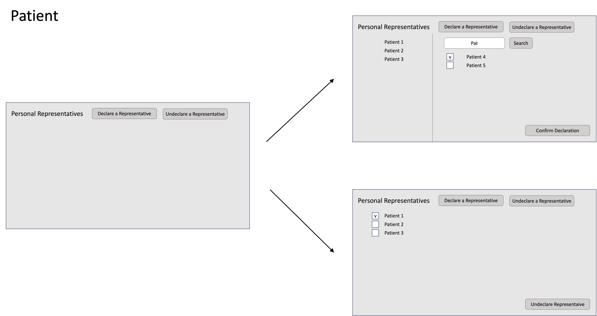
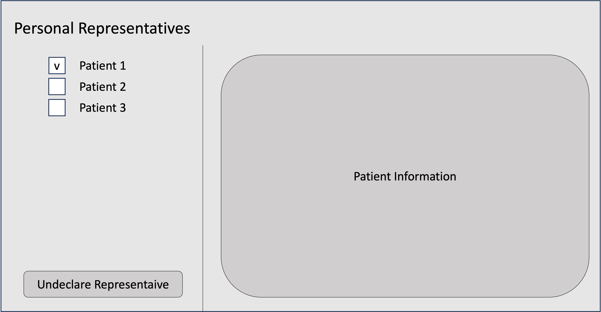
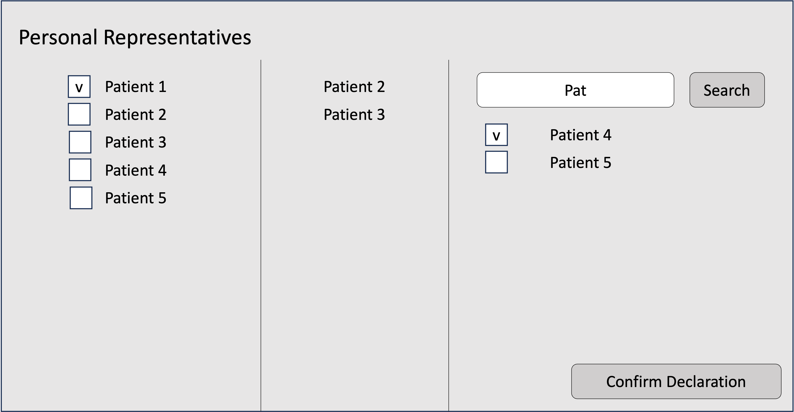

# UC16

## 설계

### Patient

- 자기가 누구의 PR인지 리스트를 볼 수 있음.
- 누가 나의 PR인지 리스트를 볼 수 있음.
- 다른 유저를 자신의 PR로 지정 또는 지정해제할 수 있음.
- 자신이 더 이상 다른 유저의 PR이 아니게끔 스스로 지정해제할 수 있음.
  (즉 스스로 타인의 보호자를 자처할 수는 없음, 단 지정되었을 때 거부는 가능)

### HCP

- 환자 하나를 다른 환자의 PR로 지정할 수 있음.
- 특정 환자의 PR이 누구인지 리스트를 볼 수 있음.
- 특정 환자가 누구의 PR인지 리스트를 볼 수 있음.

